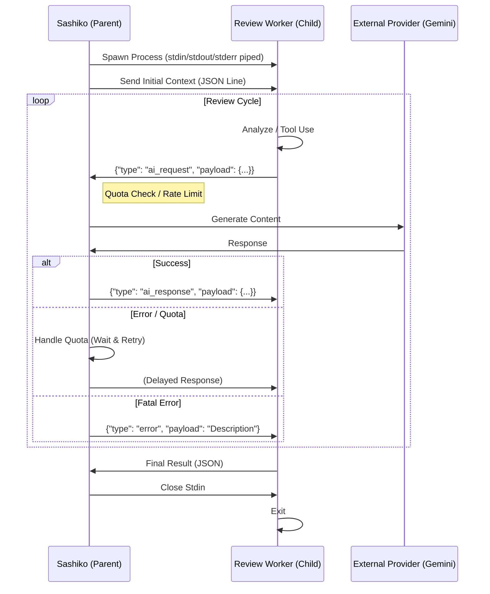

# Sashiko AI Worker Interaction Design

## Overview

This document describes the architecture and protocol for the interaction between the main `sashiko` application (Parent) and the isolated AI Review Workers (Child processes).

To ensure robust resource management, centralized rate limiting, and process isolation, the AI workers do not communicate directly with external LLM providers. Instead, they act as "dumb" workers that delegate all LLM generation requests to the parent process via a JSON-based IPC (Inter-Process Communication) protocol over standard input/output streams.

## Architecture



## Transport Layer

*   **Mechanism**: Standard Streams (Stdin, Stdout, Stderr).
*   **Format**: Line-delimited JSON (NDJSON). Each message must be a complete, valid JSON object on a single line, terminated by `\n`.
*   **Encoding**: UTF-8.

### Stream Usage

*   **Stdin (Parent -> Child)**: Used for sending the initial configuration payload and subsequent AI responses (or errors).
*   **Stdout (Child -> Parent)**: Used for sending AI requests (wrapped in a protocol envelope) and the final review result.
*   **Stderr (Child -> Parent)**: Used exclusively for unstructured logging (info, warn, error). The parent monitors this stream to log worker activities to the main system log.

## Protocol Definition

### 1. Initialization
The parent starts the child process and immediately sends the **Review Input** payload.

*   **Direction**: Parent -> Child
*   **Format**: `ReviewInput` struct (JSON)
    ```json
    {
      "id": 123,
      "subject": "Fix kernel panic in...",
      "patches": [
        { "index": 1, "diff": "..." }
      ]
    }
    ```

### 2. AI Request (Worker -> Parent)
When the worker needs to query the LLM, it emits a request message.

*   **Direction**: Child -> Parent
*   **Format**:
    ```json
    {
      "type": "ai_request",
      "payload": {
        "contents": [...],
        "tools": [...],
        "system_instruction": {...}
      }
    }
    ```
*   **Payload Schema**: Maps to `GenerateContentRequest` (Google Gemini API).

### 3. AI Response (Parent -> Worker)
The parent processes the request (handling authentication, networking, and quotas) and returns the result.

*   **Direction**: Parent -> Child
*   **Format**:
    ```json
    {
      "type": "ai_response",
      "payload": {
        "candidates": [...],
        "usage_metadata": {...}
      }
    }
    ```
*   **Payload Schema**: Maps to `GenerateContentResponse`.

### 4. Protocol Error (Parent -> Worker)
If the parent fails to execute the request (e.g., network failure after retries, invalid request), it returns an error.

*   **Direction**: Parent -> Child
*   **Format**:
    ```json
    {
      "type": "error",
      "payload": "Detailed error message string"
    }
    ```

### 5. Final Result (Worker -> Parent)
Upon completion, the worker outputs the final review data. This message **does not** have a `type` wrapper, allowing it to be distinct from protocol messages, or identified by specific fields (e.g., `patchset_id`).

*   **Direction**: Child -> Parent
*   **Format**:
    ```json
    {
      "patchset_id": 123,
      "baseline": "HEAD",
      "review": { ... },
      "patches": [ ... ]
    }
    ```

## Error Handling & Robustness

### 1. Quota Exhaustion (Rate Limiting)
*   **Problem**: The LLM provider returns `429 Too Many Requests`.
*   **Strategy**: **Transparent Retry in Parent**.
    *   The child process is **blocked** on `stdin.read_line()`.
    *   The parent detects the 429 error.
    *   The parent enters a global `QuotaManager` wait loop, pausing *all* competing requests from other workers.
    *   Once the quota resets (or backoff expires), the parent retries the request.
    *   The child eventually receives a successful `ai_response`, completely unaware of the delay.
    *   **Benefit**: Workers do not need complex retry logic; the system naturally throttles.

### 2. Transport Failures (Broken Pipe)
*   **Scenario**: The child process crashes or exits unexpectedly.
*   **Handling**:
    *   The parent's read loop on `stdout` will encounter an EOF or error.
    *   The parent treats this as a "Failed" review status.
    *   Any pending patches are marked as failed in the database.
    *   Stderr is captured to provide post-mortem context.

### 3. Malformed Protocol
*   **Scenario**: Child sends invalid JSON or Parent sends garbage.
*   **Handling**:
    *   **Parent**: If `serde_json::from_str` fails on a line from stdout, it logs the line as a warning/raw output but does not crash the main service. It may terminate the specific review task if recovery is impossible.
    *   **Child**: If it receives malformed JSON from stdin, it should panic or exit with a non-zero code, triggering the Transport Failure flow in the parent.

### 4. Timeout Safety
*   **Strategy**: While the LLM interaction can take time (especially with retries), there should be an upper bound on the *entire* review process or individual read operations if necessary.
*   **Implementation**: The parent runs the IPC loop within a `tokio::select!` with a timeout (e.g., 30 minutes). If the worker hangs, the parent kills the child process.

## Implementation Details

*   **StdioGeminiClient**: A structural implementation of the `GenAiClient` trait in the child process. It abstracts the serialization/deserialization of the IPC messages, making the `Worker` logic agnostic to the transport.
*   **QuotaManager**: A shared synchronization primitive (`Arc<QuotaManager>`) in the parent. It uses a `Mutex<Option<Instant>>` to track the "blocked until" timestamp, ensuring all threads respect the backoff signal from a single 429 response.
