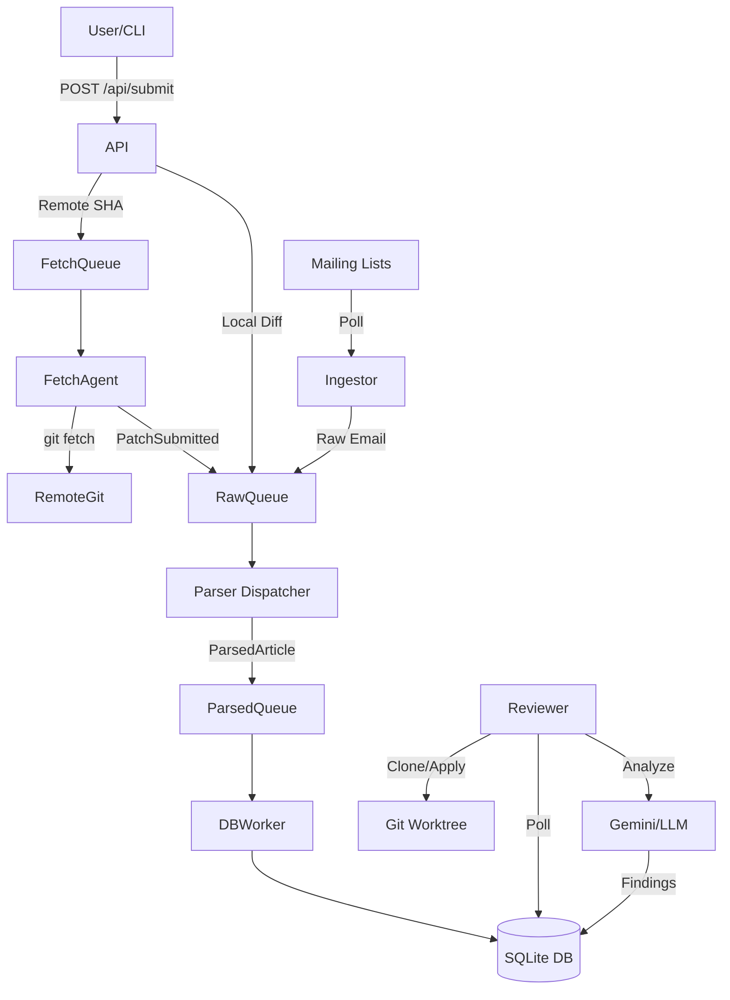

# Sashiko Architecture

Sashiko is an automated Linux kernel patch review system. It ingests patches from various sources (Mailing Lists via NNTP, Git repositories, or direct API submission), parses them, stores them in a structured database, and then uses AI agents to review them against a baseline git tree.

## Core Components

The system is built as a set of asynchronous actors communicating via channels, managed by the `tokio` runtime.

### 1. Ingestion Layer (The Entry Point)

These components accept data from the outside world and normalize it into a stream of raw events.

*   **`Ingestor` (`src/ingestor.rs`)**: 
    *   **NNTP**: Polls configured mailing lists (e.g., LKML) for new emails.
    *   **Git**: Scans git history (`rev-list`) to ingest past patches.
    *   **Output**: Sends `Event::ArticleFetched` (containing raw email bytes) to the **Raw Queue**.
*   **`Web API` (`src/api.rs`)**: 
    *   **`POST /api/submit`**: Accepts structured JSON for manual patch injection.
        *   **Local Mode**: Accepts diff, author, and description directly. Wraps in `Event::PatchSubmitted`.
        *   **Remote Mode**: Accepts a Git SHA and Repo URL. Sends a `FetchRequest` to the FetchAgent.
    *   **Output**: Sends events to **Raw Queue** or requests to **Fetch Queue**.

### 2. Fetching & Normalization

*   **`FetchAgent` (`src/fetcher.rs`)**:
    *   **Input**: `FetchRequest` (Repo URL + Commit SHA).
    *   **Logic**: Maintains a throttled queue (e.g., once per 10s) to avoid spamming remote git servers. Manages local git remotes dynamically.
    *   **Output**: Fetches the commit, extracts the patch via `git show`, and sends `Event::PatchSubmitted` to the **Raw Queue**.

### 3. Parsing & Resolution (The CPU Worker)

*   **`Parser Dispatcher` (`src/main.rs`)**:
    *   **Input**: **Raw Queue** (`Event`).
    *   **Logic**: 
        *   For `ArticleFetched` (Emails): Spawns blocking tasks to parse MIME/Email headers, extract diffs, and detect thread relationships (`In-Reply-To`).
        *   For `PatchSubmitted` (API/Fetcher): Normalizes the structured data into the internal `ParsedArticle` format.
    *   **Output**: Sends `ParsedArticle` structs to the **Parsed Queue**.

### 4. Storage & Linking (The I/O Worker)

*   **`DB Worker` (`src/main.rs`)**:
    *   **Input**: **Parsed Queue**.
    *   **Logic**: Manages a strictly serialized (or batched) transaction loop to write to SQLite.
        *   **Thread Resolution**: Links messages to threads.
        *   **Patchset Creation**: Groups individual patches into "Patchsets" (Series) based on thread ID and subject metadata (e.g., `1/4`).
        *   **State Management**: Sets initial status to `Pending` (if series is complete) or `Incomplete`.
    *   **Output**: Writes to SQLite (`patchsets`, `patches`, `messages` tables).

### 5. Review (The Intelligent Worker)

*   **`Reviewer` (`src/reviewer.rs`)**:
    *   **Trigger**: Polls the DB for `Pending` patchsets.
    *   **Logic**:
        *   **Baseline Resolution**: Determines the correct base commit to apply the patch against (using file paths and git history).
        *   **Execution**: Spawns a separate process (the `review` binary) to create an isolated git worktree, **apply the patch**, and run AI analysis.
    *   **Output**: Updates DB status to `Reviewed`, `Failed`, or `FailedToApply`.

## Data Flow Diagram

## ID Strategy

*   **Database IDs**: Internal integer Primary Keys.
*   **Message-IDs**: The primary public identifier.
    *   **Emails**: Uses the `Message-ID` header (e.g., `<2024...@example.com>`).
    *   **Git Commits**: Uses the full SHA1 hash.
    *   **Local Submissions**: Uses a synthetic ID format: `sashiko-local-<timestamp>-<random>`.
