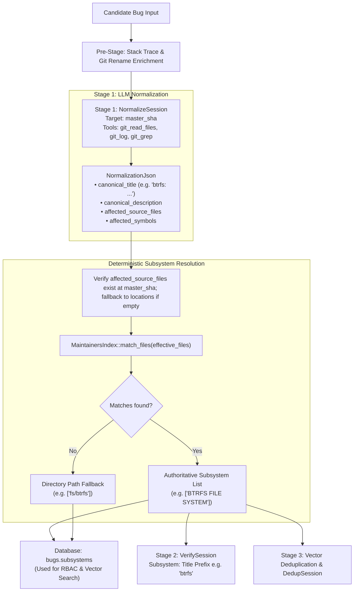

# Design: Deterministic Subsystem Detection & Enhanced Normalization

## Status
Proposed

## 1. Overview & Problem Statement

In the current Linux kernel bug pipeline, subsystem determination is partially delegated to the LLM during Stage 1 (`NormalizeSession`). The model is expected to output `primary_subsystem` (e.g., `"net"`) and `subsystems` (e.g., `["net", "fs"]`), which are then persisted in `bugs.subsystems` and used downstream for vector similarity deduplication and Role-Based Access Control (RBAC).

This introduces significant structural issues:
1. **Security & RBAC Invariants**: Access control decisions and maintainer jurisdictions must be deterministic and fail-closed. Relying on an LLM to classify official subsystem names risks hallucinations, prompt injection, and permission inconsistencies.
2. **Conflation of Commit Prefixes with Official Subsystems**: In Linux kernel development, commit title prefixes (e.g., `net:`, `mm:`, `btrfs:`, `drm/i915:`) are informal maintainer conventions. In contrast, official kernel subsystems are canonically defined by sections in the kernel's `MAINTAINERS` file. Conflating the two forces the LLM into a rigid classification role it is unsuited for.
3. **Missing Tool Guidance in Normalization**: `NormalizeSession` has access to the Git `ToolBox` (`git_log`, `git_read_files`, `git_grep`), but lacks instructions and context regarding the target commit SHA (`master_sha`). Because tools like `git_read_files` strictly require a `revision` parameter, the model is left to guess revisions or avoid reading source code altogether.

This design resolves these issues by:
- Streamlining `NormalizeSession` to focus strictly on code reasoning: producing a `canonical_title` with the historical commit prefix convention, `canonical_description`, `affected_source_files`, and `affected_symbols`.
- Passing `master_sha` and explicit tool instructions into `NormalizeSession` to ground file and symbol discovery in the mainline codebase.
- Programmatically resolving official subsystems from verified affected files using `MaintainersIndex` immediately following Normalization, persisting the authoritative list into `bugs.subsystems` for RBAC and deduplication.

---

## 2. Architectural Design



---

## 3. Detailed Specifications

### 3.1 Stage 1: LLM Normalization Updates

#### 3.1.1 Schema Changes
Remove `primary_subsystem` and `subsystems` from `NormalizationJson`. Add `affected_symbols`:

```rust
#[derive(Deserialize, Serialize, Debug, Clone)]
pub struct NormalizationJson {
    pub canonical_title: String,
    pub canonical_description: String,
    pub affected_source_files: Vec<String>,
    #[serde(default)]
    pub affected_symbols: Option<Vec<String>>,
}
```

#### 3.1.2 Pass `master_sha` to `NormalizeSession`
Update `NormalizeSession` to include `master_sha: &'a str`:

```rust
struct NormalizeSession<'a> {
    problem: &'a str,
    reasoning: &'a str,
    locations: &'a str,
    master_sha: &'a str,
    maintainers_hint: Option<String>,
    tools: Option<Arc<ToolBox>>,
    context_tag: Option<String>,
}
```

#### 3.1.3 Prompt Directives
1. **Target Commit**: Instruct the model that the mainline Linux kernel top-of-trunk is at commit `{master_sha}`.
2. **Tool Instructions**:
   - Use `git_read_files(revision: "{master_sha}", files: [...])` or `git_grep` to inspect source files and verify affected functions and symbols.
   - Use `git_log(range: "{master_sha}", limit: 5)` on affected files to observe the conventional subsystem prefix used in commit subjects by maintainers (e.g. `btrfs:`, `net:`, `mm:`, `drm/i915:`).
3. **Canonical Title**:
   - Formulate `<patch_prefix>: <defect or broken invariant in function_name()>` (strict limit of under 80 characters, no markdown, no backticks).
   - Prohibit patch/fix action verbs (`fix`, `resolve`, `prevent`, `avoid`, `handle`).
4. **Affected Files & Symbols**:
   - List the verified kernel source files in `affected_source_files`.
   - List the verified functions/structs/symbols in `affected_symbols`.

---

### 3.2 Programmatic Subsystem Hook (Post-Stage 1)

Immediately following the completion of `NormalizeSession`:

1. **Source File Sanitization**:
   - Filter `norm.affected_source_files` against `git_file_exists_at(repo_path, file, Some(master_sha))`.
   - If the resulting list is empty, fall back to files extracted from input `locations` or pre-enrichment.

2. **Authoritative `MAINTAINERS` Matching**:
   - Query `MaintainersIndex::match_files(&effective_files)`.
   - If `MaintainersIndex` yields non-empty matches, use them as the official subsystems.
   - **Fallback**: If `MaintainersIndex` matches nothing (or in tests without a full kernel tree), derive directory-based prefix tags (e.g. `fs/btrfs`, `drivers/net`) or retain input subsystems.

3. **Prefix Extraction**:
   - Helper `extract_title_prefix(&norm.canonical_title)` extracts the patch prefix before the colon `:` (e.g. `"btrfs"`).
   - Provided to `VerifySession` as the display subsystem.

---

### 3.3 Database & Access Control Integration

1. **Database Persistence**:
   - Store the deterministic `official_subsystems` vector in `bugs.subsystems` (JSON array).
   - Store `norm.canonical_title` in `bugs.problem`.
   - Store `norm.affected_source_files` in `bugs.source_files`.

2. **RBAC Scoping**:
   - Maintainer role access evaluations compare the user's authorized scopes directly against the deterministic `bugs.subsystems` entries.

3. **Vector Deduplication Search**:
   - Pass `official_subsystems` into `extract_bug_vector()`, where exact matches receive weight `4.0` and component tokens receive weight `1.5`.
   - Pass `official_subsystems` to `DedupSession` as `candidate_subsystems`.

---

## 4. Implementation Steps

1. **Update `NormalizationJson` and `NormalizeSession` in `src/workflows/linux_bug.rs`**:
   - Remove `primary_subsystem` and `subsystems` fields from `NormalizationJson`.
   - Add `affected_symbols: Option<Vec<String>>`.
   - Update `NormalizeSession` struct to accept `master_sha: &'a str`.
   - Update `system_prompt` and `initial_user_prompt` with tool usage instructions referencing `master_sha`.
   - Update `validate()` to enforce `<prefix>: <defect>` title structure without fix verbs.

2. **Implement Deterministic Subsystem Resolution**:
   - In `execute_pipeline()`, sanitize `affected_source_files` against `master_sha`.
   - Call `MaintainersIndex::match_files()` on valid files.
   - Provide directory prefix fallback if no matches found.

3. **Update Downstream Sessions and Callers**:
   - Use `extract_title_prefix()` for `VerifySession.subsystem`.
   - Pass resolved official subsystems to `extract_bug_vector`, `DedupSession`, and database updates.

4. **Update Unit Tests**:
   - Update mock responses in `test_process_issue_flow`, `test_normalize_session`, and validation tests.
   - Add test verifying `master_sha` presence in `NormalizeSession` prompt.
   - Add test verifying deterministic `MAINTAINERS` subsystem resolution.

5. **Verification**:
   - Run `make check-pr` to verify all linters, formatting, and unit tests pass.
