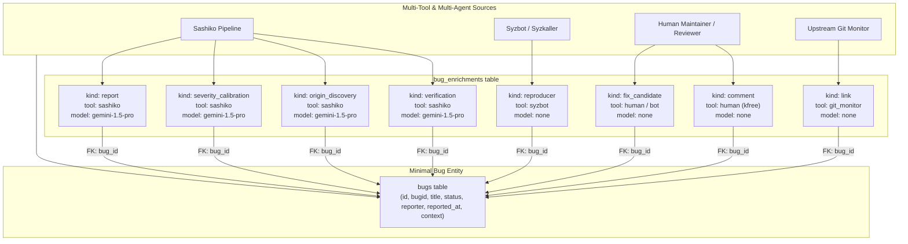

# Design: Extensible Linux Bug Schema & Enrichment Architecture

## Status
Proposed

## 1. Overview & Motivation

In Sashiko, Linux kernel bugs were initially stored in a monolithic `bugs` table with 25+ columns. This design tightly coupled immutable defect identity (ID, reporting source, timestamp) with specific pipeline outputs (verification SHA, locations, severity, introduced-in commit, LKML report, duplicate links, fix status, and tokens).

While functional for a single fixed-pipeline run, this approach exhibits significant limitations:
1. **Schema Rigidity**: Adding new analysis capabilities (e.g., reproducer generation, fix candidate synthesis, CVE tracking) requires database schema migrations and alters core data structs.
2. **Single-Source Assumption**: Defect data cannot be contributed or enriched by multiple independent tools (e.g., Sashiko review, Syzbot crash reports, external static analyzers, or human developers) without overwriting existing fields.
3. **Coarse LLM Accounting**: Token consumption and logs are recorded at the bug level as single global sums, obscuring which pipeline stage or model incurred the cost.
4. **Lack of Lifecycle Evolution**: Bugs evolve over time (candidate -> verified -> reported -> discussed -> reproduced -> fix proposed -> merged). A flat row cannot capture this chronological progression.

### Core Architecture Shift

We decouple defect identity from defect enrichments:
- **`bugs` (Core Entity)**: Contains minimal, immutable data: unique ID, title/problem summary, lifecycle status, first-reporter identity, and original discovery context.
- **`bug_enrichments` (Enrichment Entity)**: An append-only log of typed enrichments attached to a bug. Each enrichment records a timestamp, the contributing tool (e.g., `sashiko`, `syzbot`, `human`), the LLM model (if applicable), token metrics, and a typed payload.

---

## 2. Architecture & Data Flow



---

## 3. Database Schema Specification

### 3.1 `bugs` Table (Minimal Direct Data)

```sql
CREATE TABLE IF NOT EXISTS bugs (
    id INTEGER PRIMARY KEY AUTOINCREMENT,
    bugid TEXT NOT NULL UNIQUE,          -- Unique slug (e.g., 'linux-4f1a2b3c...')
    title TEXT NOT NULL,                 -- Canonical or initial defect summary
    status TEXT NOT NULL DEFAULT 'open', -- 'raw', 'open', 'fixed', 'dismissed', 'duplicate'
    reporter TEXT NOT NULL,              -- First reporter (e.g. 'sashiko:patch_review', 'syzbot', 'user:kfree')
    reported_at INTEGER NOT NULL,        -- Unix timestamp when first reported
    
    -- Immutable discovery provenance
    discovered_in_patchset_id INTEGER,   -- Optional FK to patchsets(id)
    discovered_in_patch_id INTEGER,      -- Optional FK to patches(id)
    discovered_in_commit TEXT,           -- Optional commit SHA where discovered
    source_ref TEXT,                     -- Optional external URL/URI (lore thread, syzbot link)

    created_at INTEGER NOT NULL,         -- Record creation timestamp
    updated_at INTEGER NOT NULL,         -- Last enrichment or status update timestamp

    FOREIGN KEY(discovered_in_patchset_id) REFERENCES patchsets(id),
    FOREIGN KEY(discovered_in_patch_id) REFERENCES patches(id)
);

CREATE INDEX IF NOT EXISTS idx_bugs_bugid ON bugs(bugid);
CREATE INDEX IF NOT EXISTS idx_bugs_status ON bugs(status);
CREATE INDEX IF NOT EXISTS idx_bugs_reporter ON bugs(reporter);
CREATE INDEX IF NOT EXISTS idx_bugs_reported_at ON bugs(reported_at);
```

### 3.2 `bug_enrichments` Table

```sql
CREATE TABLE IF NOT EXISTS bug_enrichments (
    id INTEGER PRIMARY KEY AUTOINCREMENT,
    bug_id INTEGER NOT NULL,             -- FK to bugs(id)
    kind TEXT NOT NULL,                  -- Enrichment kind (see Taxonomy below)
    tool TEXT NOT NULL,                  -- Tool identifier: 'sashiko', 'syzbot', 'human', etc.
    model TEXT,                          -- Optional LLM model: 'gemini-1.5-pro', 'claude-3-5-sonnet', etc.
    author TEXT,                         -- Optional author or agent role (e.g. 'kfree@google.com')
    created_at INTEGER NOT NULL,         -- Unix timestamp
    
    content TEXT,                        -- Optional human-readable markdown text, summary, or report
    data_json TEXT,                      -- Typed structured JSON payload specific to kind
    
    -- Observability & token metrics (per-enrichment)
    tokens_in INTEGER,                   -- Input tokens (net of cache)
    tokens_out INTEGER,                  -- Output tokens
    tokens_cached INTEGER,               -- Cached prompt tokens
    logs TEXT,                           -- Execution trace or LLM conversation logs

    FOREIGN KEY(bug_id) REFERENCES bugs(id) ON DELETE CASCADE
);

CREATE INDEX IF NOT EXISTS idx_bug_enrichments_bug_id ON bug_enrichments(bug_id, created_at);
CREATE INDEX IF NOT EXISTS idx_bug_enrichments_kind ON bug_enrichments(kind, bug_id);
CREATE INDEX IF NOT EXISTS idx_bug_enrichments_tool ON bug_enrichments(tool);
```

---

## 4. Taxonomy of Enrichment Kinds & Typed Payloads

Each enrichment kind defines a structured payload stored in `data_json`, while common markdown/text is stored in `content`.

### 4.1 `verification`
Records ground-truth verification of a candidate bug against a mainline kernel commit.
* `tool`: `sashiko`, `sparse`, `smatch`, `human`
* `model`: e.g. `gemini-1.5-pro` (if LLM-verified)
* `content`: Verification reasoning / proof
* `data_json`:
  ```json
  {
    "verified_on_sha": "a1b2c3d4e5f6...",
    "is_valid": true,
    "refutation_evidence": null,
    "locations": [
      {
        "file": "drivers/net/ethernet/intel/e1000/e1000_main.c",
        "line": 1234,
        "function_or_symbol": "e1000_xmit_frame",
        "code_snippet": "..."
      }
    ],
    "source_files": [
      "drivers/net/ethernet/intel/e1000/e1000_main.c"
    ]
  }
  ```

### 4.2 `report`
Stores formatted standalone LKML reports or advisory descriptions.
* `tool`: `sashiko`, `syzbot`, `human`
* `content`: Formatted standalone LKML report in markdown/plaintext
* `data_json`:
  ```json
  {
    "format": "lkml_markdown",
    "suggested_subject": "net: e1000: fix memory leak in e1000_xmit_frame()",
    "tags": ["Reported-by", "Closes"]
  }
  ```

### 4.3 `origin_discovery`
Records tracing of the commit that introduced the defect.
* `tool`: `sashiko`, `git-blame`, `git-bisect`
* `content`: Origin explanation (why this commit introduced the bug)
* `data_json`:
  ```json
  {
    "introducing_commit_sha": "7f8e9d0c1b2a...",
    "introducing_commit_title": "e1000: add multi-queue support",
    "introducing_commit_author": "Developer Name <dev@example.com>",
    "blame_lines": [1230, 1231, 1234],
    "method": "llm_trace"
  }
  ```

### 4.4 `severity_calibration`
Records calibrated severity rating, blast radius, and subsystem assignments.
* `tool`: `sashiko`, `human`
* `content`: Severity rationale and attack precondition analysis
* `data_json`:
  ```json
  {
    "severity": "High",
    "subsystems": ["net", "intel"],
    "attack_vector": "remote_network",
    "privileges_required": "none"
  }
  ```

### 4.5 `reproducer`
Stores instructions or executable code that triggers the bug.
* `tool`: `syzbot`, `human`, `sashiko`
* `content`: Setup instructions, environment prerequisites, and reproduction steps
* `data_json`:
  ```json
  {
    "repro_type": "c_program",
    "source_code": "#define _GNU_SOURCE\n#include <stdio.h>...",
    "kernel_config": "CONFIG_KASAN=y\nCONFIG_KASAN_INLINE=y",
    "architecture": "x86_64",
    "syz_repro_url": "https://syzkaller.appspot.com/text?tag=ReproSyz..."
  }
  ```

### 4.6 `fix_candidate`
Stores proposed patches, pull requests, or merged fixes.
* `tool`: `sashiko`, `human`, `git_monitor`
* `content`: Commit message or patch explanation
* `data_json`:
  ```json
  {
    "status": "proposed",
    "patch_diff": "--- a/drivers/net/... \n+++ b/drivers/net/...",
    "commit_sha": "d4e5f6a1b2c3...",
    "commit_title": "net: e1000: fix memory leak",
    "mr_or_pr_url": "https://lore.kernel.org/all/..."
  }
  ```

### 4.7 `comment`
Human engineer discussion, maintainer notes, or triage comments.
* `tool`: `human`, `web_ui`
* `author`: `kfree@google.com`
* `content`: "Discussed with subsystem maintainer; fix will be queued for v6.14-rc2."
* `data_json`:
  ```json
  {
    "reply_to_enrichment_id": null
  }
  ```

### 4.8 `link`
References to external issue trackers, lore threads, Bugzilla, or CVEs.
* `tool`: `sashiko`, `human`, `cve_monitor`
* `content`: Link description
* `data_json`:
  ```json
  {
    "url": "https://lore.kernel.org/netdev/20260830...",
    "title": "LKML netdev discussion thread",
    "link_type": "lore_kernel_org"
  }
  ```

### 4.9 `deduplication`
Records vector search deduplication outcomes and links duplicate bugs.
* `tool`: `sashiko`
* `content`: Deduplication comparison reasoning
* `data_json`:
  ```json
  {
    "is_duplicate": true,
    "canonical_bug_id": 42,
    "canonical_bugid": "linux-7b8c9d...",
    "similarity_score": 0.94
  }
  ```

---

## 5. Multi-Tool Integration Scenarios

### Scenario A: Sashiko Pipeline Run
1. Patch review discovers candidate defect -> creates row in `bugs` (`status = 'raw'`).
2. Stage 1 (Verification) -> appends `kind = 'verification'`, `tool = 'sashiko'`, `model = 'gemini-1.5-pro'`.
3. Stage 3 (Deduplication) -> appends `kind = 'deduplication'`.
4. Stage 4 (Origin Tracing) -> appends `kind = 'origin_discovery'`.
5. Stage 5 (Severity) -> appends `kind = 'severity_calibration'`.
6. Stage 6 (Report) -> appends `kind = 'report'`.
7. Pipeline marks `bugs.status = 'open'`.

### Scenario B: Syzbot Crash Ingestion
1. Syzbot webhook/ingestion creates row in `bugs` (`reporter = 'syzbot'`, `title = 'KASAN: use-after-free in e1000_xmit_frame'`).
2. Syzbot adds `kind = 'reproducer'`, `tool = 'syzbot'` with C program and syz repro script.
3. Syzbot adds `kind = 'link'`, `tool = 'syzbot'` pointing to syzkaller dashboard.
4. Sashiko pipeline picks up the bug for enrichment:
   - Verifies against mainline -> appends `kind = 'verification'`.
   - Traces origin commit -> appends `kind = 'origin_discovery'`.
   - Synthesizes fix candidate -> appends `kind = 'fix_candidate'`.

### Scenario C: Human Review & Upstream Resolution
1. Human maintainer views bug on Sashiko UI.
2. Maintainer posts triage notes -> appends `kind = 'comment'`, `tool = 'human'`, `author = 'kfree'`.
3. Fix patch is submitted to LKML -> maintainer or bot appends `kind = 'link'` and `kind = 'fix_candidate'`.
4. Upstream git commit merges fix -> bot appends `kind = 'fix_candidate'` (`status = 'merged'`, `commit_sha = '...'`) and updates `bugs.status = 'fixed'`.

---

## 6. Implementation Strategy (Direct Schema Replacement)

As confirmed, the Linux bug feature is currently in active development on local development branches and is not deployed in production. Therefore, no legacy backward compatibility shims or complex multi-step database migrations are required. We proceed with a clean, direct implementation of the generalized schema.

### 6.1 Database Schema Definition (`src/schema.sql`)
1. Replace the legacy 25-column `bugs` table with the minimal core `bugs` table.
2. Create the `bug_enrichments` table with indexes on `(bug_id, created_at)`, `(kind, bug_id)`, and `(tool)`.
3. Retain `review_bugs` junction table linking `reviews(id)` and `bugs(id)`.
4. Retain `bugs_subsystems` junction table linking `bugs(id)` and subsystem names for fast multi-subsystem filtering.

### 6.2 Rust Domain Model (`src/db.rs`)
1. Define `Bug` and `BugEnrichment` structs representing the clean models:
   ```rust
   #[derive(Debug, Clone, Serialize, Deserialize)]
   pub struct Bug {
       pub id: i64,
       pub bugid: String,
       pub title: String,
       pub status: String,
       pub reporter: String,
       pub reported_at: i64,
       pub discovered_in_patchset_id: Option<i64>,
       pub discovered_in_patch_id: Option<i64>,
       pub discovered_in_commit: Option<String>,
       pub source_ref: Option<String>,
       pub created_at: i64,
       pub updated_at: i64,
       pub enrichments: Vec<BugEnrichment>,
   }

   #[derive(Debug, Clone, Serialize, Deserialize)]
   pub struct BugEnrichment {
       pub id: i64,
       pub bug_id: i64,
       pub kind: String,
       pub tool: String,
       pub model: Option<String>,
       pub author: Option<String>,
       pub created_at: i64,
       pub content: Option<String>,
       pub data_json: Option<serde_json::Value>,
       pub tokens_in: Option<i64>,
       pub tokens_out: Option<i64>,
       pub tokens_cached: Option<i64>,
       pub logs: Option<String>,
   }
   ```
2. Implement clean database methods:
   - `insert_bug(...) -> Result<Bug>`
   - `add_bug_enrichment(...) -> Result<BugEnrichment>`
   - `get_bug(id) -> Result<Option<Bug>>` (fetches bug along with all its enrichments)
   - `get_bug_by_bugid(bugid) -> Result<Option<Bug>>`
   - `list_bugs(...) -> Result<Vec<Bug>>`
   - `update_bug_status(id, status)`

### 6.3 Pipeline Stages (`src/workflows/linux_bug.rs`)
Update `process_issue_worker` so that each completed stage appends its specific enrichment:
- Initial raw candidate: recorded at ingestion as `bugs.title`, `bugs.reporter`, and an initial raw input or candidate enrichment.
- Stage 1 (Verification): appends `verification` enrichment with verified mainline SHA, locations, source files, and refutation evidence.
- Stage 2 (Normalization): updates `bugs.title` and associates resolved subsystems in `bugs_subsystems`.
- Stage 3 (Deduplication): appends `deduplication` enrichment linking canonical bug if duplicate.
- Stage 4 (Origin Tracing): appends `origin_discovery` enrichment with introducing commit SHA, author, title, blame lines.
- Stage 5 (Severity Calibration): appends `severity_calibration` enrichment with calibrated severity and explanation.
- Stage 6 (Report Generation): appends `report` enrichment with standalone LKML text.

### 6.4 API Endpoints (`src/api.rs`)
1. `GET /api/bug?id=...` or `?slug=...`: Returns the bug with all its enrichments, plus aggregated token counts.
2. `GET /api/bug/logs`: Fetches logs from all enrichments belonging to the bug.
3. `POST /api/bug/:id/enrichments`: Allows adding custom enrichments (comments, reproducers, fix candidates, external links).

### 6.5 Frontend (`static/index.html`)
1. Header: Bug ID, canonical title, and status badge.
2. Discovery / Identity Section: Reporter, reporting timestamp, patchset/patch/commit context.
3. Enrichment Feed: Chronological stream of cards showing:
   - Verification card (with verified mainline commit and locations)
   - Origin Tracing card (with introduced-by commit)
   - Severity & Triage card
   - Defect Report card (with LKML description and copy button)
   - Reproducers, links, comments, and fix candidates (each with its tool and model badge)
4. Footer: Granular token accounting summed across all enrichments, and raw log link.

---

## 7. Implementation Plan

1. **Step 1: Schema & DB Layer**:
   - Update `src/schema.sql` with new `bugs` and `bug_enrichments` tables.
   - Update `src/db.rs` with `Bug`, `BugEnrichment`, and CRUD operations.
2. **Step 2: Pipeline Refactoring**:
   - Update `src/workflows/linux_bug.rs` to write individual enrichments per stage.
3. **Step 3: API & Worker Updates**:
   - Update `src/api.rs` and `src/worker/bug_worker.rs`.
4. **Step 4: Frontend Update**:
   - Update `static/index.html` to render the extensible enrichment feed.
5. **Step 5: Verification & Tests**:
   - Update unit tests in `src/db.rs`, `src/api.rs`, and `src/workflows/linux_bug.rs`.
   - Run `make check-pr` to ensure all checks pass.
