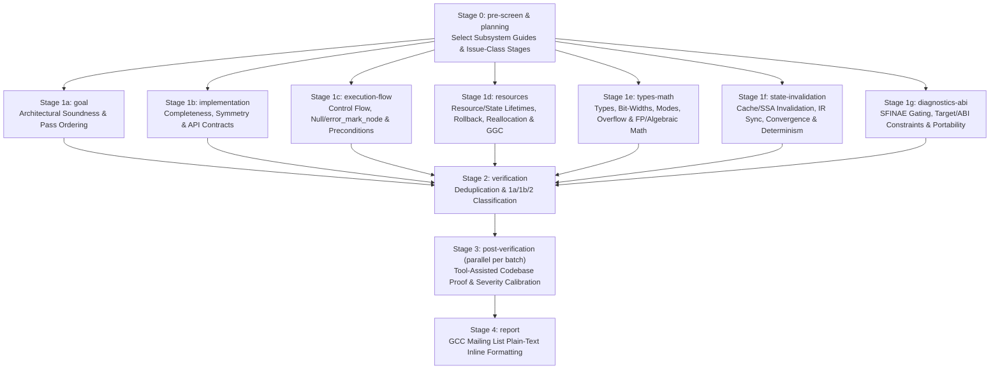

# Sashiko for GCC: Architecture & Workflow Design

## 1. Executive Summary

This document defines the architecture for reviewing **GNU Compiler Collection (GCC)** patches with Sashiko (`--project gcc`). It covers:
1. An empirical inspection of GCC bug tracking, revision descriptors, and historical defect patterns across 20,400+ Bugzilla-linked commits (`third_party/gcc`).
2. Community norms and expectations on `gcc-patches@gcc.gnu.org`, including GNU coding style, GCC diagnostic conventions, and the GCC security model (`SECURITY.txt`).
3. The methodology for constructing the 1,000-bug, 100-bug, and 10-bug ground-truth GCC benchmarks (`benchmarks/gcc/`).
4. The multi-stage LLM review workflow (`src/workflows/gcc_patch_review.rs`), prompt hierarchy (`prompts/gcc/`), and C++/DSL context prefetcher (`src/worker/prefetch.rs`).

---

## 2. GCC as a Project: Bug Tracking & Revision Model

### 2.1 Bugzilla and Commit Log Discipline
GCC tracks defects in **GCC Bugzilla** (`https://gcc.gnu.org/bugzilla/`). Every bug is assigned a numeric ID and categorized under a Bugzilla component (referred to in commits and discussions as `PR <component>/<id>` or `PR<id>`, where `PR` stands for historical GNATS *Problem Report*).

GCC enforces strict commit message structure via `contrib/gcc-changelog/git_commit.py` (executed by server-side git hooks and daily `DATESTAMP` / `ChangeLog` generation jobs):
- Every Bugzilla reference in a commit log or ChangeLog entry must follow `PR <component>/<number>` using an approved component from `bug_components` (e.g., `PR tree-optimization/118234`, `PR target/119001`, `PR c++/117555`).
- Since GCC transitioned from SVN to Git in January 2020, commits in Bugzilla comments and regression fixes are identified using **GCC revision descriptors** generated by `contrib/git-descr.sh` (`git gcc-descr`):
  ```text
  r<major>-<count>-g<shaprefix>   (e.g., r15-4321-g0123456789abcd)
  ```
  where `<major>` is the GCC major release branch development cycle (e.g., `r15` for GCC 15 trunk development) and `<count>` is the linear commit count since `refs/tags/basepoints/gcc-<major>`. `contrib/git-undescr.sh` resolves `r<major>-<count>` back to an exact git SHA via `git rev-parse refs/tags/basepoints/gcc-<major>~<total - count>`.

### 2.2 Empirical Distribution of GCC Bugs (2020–2026)
An analysis of `third_party/gcc` git history from 2020 through 2026 identified **20,474 commits** referencing Bugzilla PRs (`PR <component>/<id>`), including **1,563 regression fixes** that explicitly cite the bug-introducing `r1X-N` revision and **282+** additional fixes citing `commit <sha>` / `caused by <sha>`.

Top Bugzilla components across recent GCC development:

| Component | Share of PR Fixes | Primary Source Directories | Core Concerns |
| :--- | :---: | :--- | :--- |
| `target` | ~24.8% | `gcc/config/<arch>/*` (`.cc`, `.md`, `.h`) | Machine descriptions (`define_insn`/`define_split`), register constraints, clobbers, calling conventions, vector intrinsics |
| `tree-optimization` | ~18.7% | `gcc/tree-ssa-*.cc`, `gcc/tree-vect-*.cc`, `gcc/match.pd`, `gcc/gimel-*.cc`, `gcc/value-range*` | GIMPLE/SSA passes, `match.pd` algebraic rewrites, VRP/ranger, loop/SLP vectorization, alias/VDEF updates |
| `c++` | ~13.9% | `gcc/cp/*.cc` | Templates (`pt.cc`), `constexpr`, concepts, coroutines, C++20 modules, SFINAE (`tf_warning_or_error`), `error_mark_node` recovery |
| `fortran` | ~10.1% | `gcc/fortran/*.cc` | Frontend resolution (`resolve.cc`), array descriptors, intrinsic lowering (`trans-*.cc`), module symbol handling |
| `libstdc++` | ~6.7% | `libstdc++-v3/include/*`, `libstdc++-v3/src/*` | C++20/23 `<ranges>`, `<format>`, `constexpr` containers, iterator/view lifetime, ABI stability |
| `middle-end` | ~6.3% | `gcc/fold-const.cc`, `gcc/expr.cc`, `gcc/cfgexpand.cc`, `gcc/gimplify.cc`, `gcc/omp-*.cc` | Constant folding, GIMPLE-to-RTL expansion, OpenMP/OpenACC lowering, built-in expansion |
| `rtl-optimization` | ~4.2% | `gcc/combine.cc`, `gcc/lra-*.cc`, `gcc/cse.cc`, `gcc/ira*.cc`, `gcc/simplify-rtx.cc` | Instruction combination, LRA/IRA register allocation, RTL canonicalization, `SUBREG` semantics |
| `c` | ~3.2% | `gcc/c/*.cc`, `gcc/c-family/*.cc` | C23 types, attributes, `_BitInt`, composite types, tentative parsing |
| `analyzer` | ~3.4% | `gcc/analyzer/*.cc` | Static analyzer abstract state (`region_model`, `svalue`), symbolic execution explosion |
| `ipa` & `lto` | ~2.0% | `gcc/ipa-*.cc`, `gcc/cgraph*.cc`, `gcc/lto*.cc` | Callgraph clone materialization, devirtualization, LTO streaming invariants |
| `debug`, `sanitizer`, `other` | ~6.7% | `gcc/dwarf2out.cc`, `gcc/asan.cc`, `gcc/ubsan.cc`, `gcc/ggc-*.cc` | DWARF generation, debug statement (`DEBUG_BEGIN_STMT`) drift, `-fcompare-debug`, GGC/PCH |

---

## 3. Historically Most Important Problems in GCC

In the GCC community, bugs are prioritized by their Bugzilla keyword classification and impact on compiled code and compiler stability:

### 3.1 `wrong-code` (Silent Miscompilation — Highest Priority)
A `wrong-code` bug occurs when GCC silently generates assembly that violates the semantics of a valid input program. These are the most severe defects in GCC because they corrupt user applications without any compiler diagnostic. Major recurring causes include:
1. **Unsound Algebraic & Bitwise Rewrites (`match.pd`, `fold-const.cc`, `simplify-rtx.cc`)**:
   - Assuming wrap-around or undefined overflow without checking `TYPE_OVERFLOW_WRAPS(type)` vs. `TYPE_OVERFLOW_UNDEFINED(type)`.
   - Rewriting signed division, modulo, or negation without guarding against `TYPE_MIN_VALUE` (`INT_MIN / -1` or `-INT_MIN`), or introducing undefined overflow on paths that were previously guarded ( requiring `rewrite_to_defined_overflow`).
   - Rewriting bit shifts without checking negative or `>= precision` shift counts (`SHIFT_COUNT_TRUNCATED` on RTL).
   - Floating-point transformations that ignore `HONOR_NANS(mode)`, `HONOR_INFINITIES(mode)`, `HONOR_SIGNED_ZEROS(mode)`, `flag_trapping_math` (e.g., swapping `LTGT_EXPR` or reordering comparisons that alter `FE_INVALID` trapping behavior), or `flag_rounding_math`.
2. **Stale SSA Flow-Sensitive Metadata & Missing IR Updates**:
   - Reusing an existing `SSA_NAME` or replacing its defining statement with a broader value without calling `reset_flow_sensitive_info(lhs)` (leaving stale value ranges or nonzero bits that cause later VRP/CCP passes to miscompile downstream branches) or `reset_flow_sensitive_info_in_bb`.
   - Modifying a `gimple *` statement in place without calling `update_stmt(stmt)`, or deleting a memory-writing statement without calling `unlink_stmt_vdef(stmt)` and releasing virtual defs.
3. **`wide_int` Precision, Sign Extension, and Type Mismatches**:
   - Confusing `wi::to_wide(t)` with `wi::to_widest(t)` or `wi::to_offset(t)`, or performing `wide_int` comparisons (`wi::lt_p`, `wi::le_p`) with the wrong `signop` (`SIGNED` vs `UNSIGNED`, `TYPE_SIGN(type)`).
   - Constructing `build_int_cst(type, val)` with a signed 64-bit integer when `type` is wider than `HOST_WIDE_INT` or unsigned, or passing mismatched operand types to `fold_build2(code, type, op0, op1)` without `fold_convert`.
4. **Scalable Vector (`poly_int`) Misuse**:
   - Treating `poly_int64` / `poly_uint64` sizes/offsets (used by AArch64 SVE and RISC-V RVV) as compile-time constants via `.to_constant()` without guarding with `.is_constant()`.
   - Confusing `maybe_eq(a, b)` / `maybe_lt(a, b)` (true if *possibly* equal/less for some runtime VL) with `known_eq(a, b)` / `known_lt(a, b)` (true for *all* runtime VLs). Must-alias or exact-match transforms require `known_*`; may-alias hazard checks require `maybe_*`.
5. **Target Backend & RTL Semantic Bugs (`gcc/config/*`, `combine.cc`, `lra-*.cc`)**:
   - Missing `(clobber (reg:CC ...))` or scratch register clobbers in `define_insn` / `define_split` / `define_peephole2`.
   - Multi-instruction output templates that overwrite an input operand register before reading remaining inputs without an earlyclobber constraint (`=&r`).
   - Incorrect `SUBREG_BYTE` / lane offset calculations on big-endian targets (`BYTES_BIG_ENDIAN`, `WORDS_BIG_ENDIAN`).
   - Emitting instructions during `define_split` after reload (`reload_completed`) that try to allocate new pseudo-registers (`gen_reg_rtx` when `!can_create_pseudo_p()`).
6. **`-fcompare-debug` Failures (Debug Statement Codegen Drift)**:
   - Allowing `is_gimple_debug(stmt)` or `DEBUG_INSN_P(insn)` to affect pass heuristics, instruction counts, UIDs, or loop trip estimates—causing different executable code with `-g` vs. `-g0`.

### 3.2 `ice-on-valid-code` and `ice-on-invalid-code` (Internal Compiler Errors)
An ICE crashes the compiler via `gcc_assert`, `gcc_unreachable`, `internal_error`, or a segmentation fault:
1. **Unchecked `error_mark_node` and `NULL_TREE` / `NULL` `rtx` Propagation**:
   - In C/C++/Fortran frontends, invalid user code or failed template substitution returns `error_mark_node` (or sets `TREE_TYPE(t) == error_mark_node`). Code that inspects `TYPE_MAIN_VARIANT(TREE_TYPE(t))` or `DECL_CONTEXT(t)` without checking `error_operand_p(t)` or `t == error_mark_node` triggers a `TREE_CHECK` ICE (`ice-on-invalid-code`).
   - Assuming `SSA_NAME_DEF_STMT(op)` is a `gassign *` without checking `is_gimple_assign(def_stmt)` (it could be a `GIMPLE_PHI`, `GIMPLE_ASM`, `GIMPLE_CALL`, or `GIMPLE_NOP` default def).
2. **Unsafe Tree/RTX Accessor Macros (`--enable-checking`)**:
   - Using `TREE_INT_CST_LOW(t)` or `wi::to_wide(t)` without verifying `TREE_CODE(t) == INTEGER_CST` (e.g., crashing when `t` is an `SSA_NAME`, `ADDR_EXPR`, or `POLY_INT_CST`).
   - Accessing `XEXP(x, 0)` or `REGNO(x)` without checking `REG_P(x)` / `MEM_P(x)` (e.g., when an operand is a `SUBREG`, `CONST_INT`, or `PARALLEL`).
3. **IR Verification Failures (`verify_gimple`, `verify_ssa`, `verify_rtl_sharing`, `verify_flow_info`)**:
   - Inserting non-GIMPLE trees directly into a `gimple_assign` without `force_gimple_operand_gsi`.
   - Sharing mutable RTL nodes (`MEM`, `REG` in certain contexts, complex expressions) across multiple insns without `copy_rtx(x)`.
   - Leaving unreachable blocks, unsplit critical edges, or stale dominator info after CFG modifications.

### 3.3 `rejects-valid`, `accepts-invalid`, and SFINAE Bugs
1. **SFINAE `tsubst_flags_t` (`complain`) Violations in `gcc/cp/`**:
   - Functions taking `tsubst_flags_t complain` must guard hard diagnostics with `if (complain & tf_error)` (and warnings with `if (complain & tf_warning)`). Calling `error(...)` or `permerror(...)` unconditionally breaks SFINAE and tentative parsing, turning valid overload resolution into a hard compile error (`rejects-valid`).
2. **State Leakage Across Tentative Parsing**:
   - Modifying global or scope declarations irreversibly during `cp_parser_parse_tentatively` before committing (`cp_parser_commit_to_tentative_parse`).

### 3.4 GGC (`GTY(())`), Precompiled Headers (PCH), Container Invalidation & Host UB
1. **Garbage Collector (`ggc`) & PCH Hazards**:
   - Storing `tree`, `rtx`, or `gimple *` pointers inside a heap-allocated or static C++ struct not marked `GTY(())` across a potential `ggc_collect()` call causes use-after-free when GC sweeps unreferenced GC objects.
   - Storing raw non-GC pointers or unannotatable C++ members inside a `GTY(())` struct without `GTY((skip))` breaks `gengtype` or crashes PCH save/restore (`gt_pch_nx`).
2. **Vector & Hash Table Reference Invalidation**:
   - Holding a reference or pointer into a `vec<T>` / `auto_vec<T>` or `hash_map<K, V>` / `hash_table<D>` across a call that may reallocate the container (`safe_push`, `reserve`, `put`, `get_or_insert`, or recursive calls into the same table).
3. **Host Undefined Behavior (`bootstrap-ubsan` / `bootstrap-asan`)**:
   - Shifting `1 << bit` instead of `HOST_WIDE_INT_1U << bit`, signed integer overflow on host counters, or reading uninitialized variables.

### 3.5 `compile-time-hog` (Non-Termination & Algorithmic Blowup)
- `match.pd` or `combine` rules that are not strictly complexity-reducing or canonical, causing infinite ping-pong folding.
- Unbounded recursive walks over `SSA_NAME` definitions, `VALUE` CSE chains, or template instantiations without a `bitmap` / `hash_set` visited guard or a depth limit (`--param`).

---

## 4. Community Expectations: Style, Formatting, Language & Security Model

### 4.1 `gcc-patches@gcc.gnu.org` Review Culture & Formatting
Patch reviews on `gcc-patches@gcc.gnu.org` follow long-standing mailing list conventions:
1. **Plain-Text Inline Email Replies Only**:
   - Reviews are plain text, hard-wrapped at 72–76 characters, with **no Markdown** (no `**bold**`, no `###` headers, no fenced code blocks, no backticks `` ` ``).
   - Reviewers quote the specific lines of the patch with `> ` and place their technical analysis immediately below the quoted hunk.
2. **Direct, Constructive Technical Language**:
   - Use standard GCC domain terminology accurately (`SSA_NAME`, `GIMPLE_PHI`, `match.pd`, `TYPE_OVERFLOW_UNDEFINED`, `error_mark_node`, `complain & tf_error`, `can_create_pseudo_p()`, `reset_flow_sensitive_info`, `poly_int`).
   - Avoid vague or speculative comments. When reporting a bug, specify the exact input shape or IR state that triggers it (e.g., *"When `op0` is a `POLY_INT_CST` (such as an SVE vector length on AArch64), `TREE_INT_CST_LOW (op0)` will ICE in `tree_check_failed`."* or *"If `!(complain & tf_error)` during SFINAE substitution, this unconditional `error_at` call rejects valid overload candidates."*).
3. **GCC Internal Diagnostic Formatting (`gcc/doc/ux.texi`)**:
   - When a patch emits user-facing compiler diagnostics (`error_at`, `warning_at`, `inform`), GCC requires `%qs` for quoted strings, `%qE` / `%qD` / `%qT` for quoted trees/decls/types, and `%<...%>` instead of literal ASCII single quotes or backticks (enforced by `contrib/check-internal-format-escaping.py`).

### 4.2 GCC Security Model (`SECURITY.txt`)
Per GCC's official `SECURITY.txt`:
- **Compiler crashes (ICEs), infinite loops, or excessive memory consumption on untrusted source code are NOT security vulnerabilities.** GCC assumes the compiler itself runs on trusted source code.
- **Actual high-severity / security-relevant defects in GCC are**:
  1. **`wrong-code` bugs** where GCC miscompiles valid source code (especially miscompilations that elide bounds checks, corrupt stack frames/canaries, break atomics/locking, or violate ABI).
  2. **Bugs in GCC target runtime libraries** (`libgcc`, `libstdc++`, `libgomp`, `libatomic`, `libitm`, `libgfortran`, etc.) that execute inside user applications.

### 4.3 Severity Calibration for GCC Reviews
Sashiko maps GCC defects onto its 4-tier severity model as follows:
- **Critical**:
  - `wrong-code`: Silent miscompilation of valid source code (bad algebraic rewrite, broken alias/VDEF tracking, missing `CC` clobber, wrong `wide_int` sign/precision, unsafe `poly_int` constant assumption, ABI/calling-convention violation).
  - Memory safety or data corruption bugs in target runtime libraries (`libstdc++`, `libgcc`, `libgomp`).
- **High**:
  - `ice-on-valid-code`: Deterministic compiler crash (`gcc_assert`, `TREE_CHECK`, null dereference, IR verification failure) on valid input code or valid target flags.
  - `rejects-valid`: Rejecting valid C/C++/Fortran/Ada programs (including breaking SFINAE via unguarded `error()` when `!(complain & tf_error)`).
  - `-fcompare-debug` codegen divergence.
  - Compiler memory corruption: GGC `GTY(())` / PCH use-after-free, `vec`/`hash_table` reference invalidation across reallocation, or host UB that breaks `bootstrap-ubsan`/`bootstrap-asan`.
- **Medium**:
  - `ice-on-invalid-code`: Compiler crash on ill-formed user code due to missing `error_mark_node` / `error_operand_p` checks during error recovery.
  - `accepts-invalid`: Failing to diagnose ill-formed code required by the language standard.
  - `compile-time-hog`: Infinite folding loops or severe algorithmic blowup (`O(N^2)`/`O(2^N)`) on realistic inputs.
  - Host memory/resource leaks (`BITMAP_FREE`, `vec::release()`, `free()`) on normal or error paths.
  - Cross-target or non-default configuration build failures (`#ifdef` unused variable/function errors under `-Werror`).
- **Low**:
  - Inaccurate source locations (`location_t` / `EXPR_LOCATION`) or malformed GCC diagnostic format strings (`%qs` vs raw quotes).

---

## 5. GCC Benchmark Design (`benchmarks/gcc/`)

To evaluate Sashiko on real-world GCC regressions, we construct a ground-truth benchmark suite in `benchmarks/gcc/` following the same schema as `benchmarks/benchmark.json`:
```json
{
  "Commit": "<40-char git SHA of the bug-introducing commit>",
  "Fixed-by": "<40-char git SHA of the regression-fixing commit>",
  "subsystem": "<GCC Bugzilla component / subsystem>",
  "problem_description": "<Concise ground-truth summary of the defect from the fix commit>"
}
```

### 5.1 Mining & Validation Pipeline
1. **Commit Discovery**:
   - Scan `third_party/gcc` git history (2020–2026) for commits that reference a Bugzilla PR (`PR <component>/<number>`) AND explicitly identify the introducing commit via:
     - Full GCC descriptor `r<major>-<count>-g<sha>`,
     - Short GCC descriptor `r<major>-<count>` resolved deterministically via `refs/tags/basepoints/gcc-<major>`, or
     - Explicit phrasing (`commit <sha>`, `caused by <sha>`, `introduced by <sha>`, `since <sha>`).
2. **Quality & Solvability Filters**:
   - Both `Commit` and `Fixed-by` must exist in `third_party/gcc` and `Commit` must be an ancestor of `Fixed-by`.
   - `Commit` must modify compiler or runtime library source files (`gcc/`, `libstdc++-v3/`, `libgcc/`, `libcpp/`, `libgomp/`, etc.), excluding commits that only touch `gcc/testsuite/`, `ChangeLog*`, `DATESTAMP`, or documentation.
   - `Fixed-by` must modify at least one non-testsuite source file in the same subsystem as `Commit` (ensuring the fix directly addresses a defect introduced by `Commit`, not an unrelated refactoring).
   - Diff size of `Commit` (excluding `gcc/testsuite/` and `ChangeLog`) must be bounded (<= 600 changed lines across <= 10 source files) so the patch is representative of a reviewable patch submission.
   - Deduplicate by `Commit` (keeping the clearest/most direct fix) and by `Fixed-by`.
3. **Three Benchmark Tiers**:
   - `benchmarks/gcc/benchmark.json`: **1,000 bugs** spanning all major GCC components (`target`, `tree-optimization`, `c++`, `fortran`, `middle-end`, `rtl-optimization`, `c`, `libstdc++`, `ipa`, `analyzer`, `lto`, `debug`, `sanitizer`).
   - `benchmarks/gcc/benchmark_100.json`: **100 bugs** stratified across components and defect classes (`wrong-code`, `ice-on-valid-code`, `ice-on-invalid-code`, `rejects-valid`, GGC/memory, RTL/target).
   - `benchmarks/gcc/benchmark_10.json`: **10 representative bugs** covering the core GCC failure modes (`match.pd` / GIMPLE optimization, VRP/ranger or SSA update, RTL/target machine description, C++ frontend template/SFINAE/`error_mark_node`, middle-end folding/expansion, Fortran/C frontend, and container/memory safety).

---

## 6. GCC Review Workflow Architecture

### 6.1 Stage Pipeline (`src/workflows/gcc_patch_review.rs`)
Mirroring the Diverge-and-Converge architecture of `linux_patch_review.rs`, `gcc_patch_review.rs` runs `pre-screen` (selecting GCC subsystem guides from `prompts/gcc/subsystem/subsystem.md` to inject into the system prompt) and `planning` followed by **7 parallel issue-class discovery stages** (3 mandatory + 4 optional), a `verification` stage, parallel `post-verification` stages, and a `report` stage:



### 6.2 Orthogonal Issue-Class Discovery Stages for GCC

Stages are organized by **class of defect** (with minimal overlap) rather than by GCC directory/subsystem, while subsystem-specific context (`gimple-ssa.md`, `c-cpp-frontend.md`, `rtl-backend.md`, etc.) is injected dynamically by `pre-screen` into all stages:

1. **`goal` (Architectural Soundness & Pass Ordering — Mandatory)**:
   - Evaluates conceptual soundness, compiler phase/pass placement, language standard/ABI compliance, and whether newly added guards or fallbacks defeat the commit's stated purpose on valid inputs.
2. **`implementation` (Completeness, Symmetry & API Contracts — Mandatory)**:
   - Audits whether the code faithfully implements commit claims, checks horizontal symmetry across sibling functions/overloads/operators/passes in the same file, checks for leftover duplicate calls after code motion, and verifies caller/callee/target-hook parameter contracts.
3. **`execution-flow` (Control Flow, Null/`error_mark_node` & Preconditions — Mandatory)**:
   - Traces local and interprocedural control flow, off-by-one/bounds checks, null pointer dereferences (`NULL_TREE`, `NULL_RTX`, `gimple_bb == NULL`), `error_mark_node` / `error_operand_p` propagation (`ice-on-invalid-code`), and checked accessor macro preconditions (`TREE_CHECK`, `DECL_P` vs `TYPE_P`, `RTX_CHECK`, `REG_P` vs `SUBREG_P`, `tree_fits_shwi_p`/`uhwi_p`).
4. **`resources` (Resource & State Lifetimes, Rollback, Reallocation & GGC — Optional)**:
   - Audits `alloc -> init -> use -> cleanup -> free` lifecycles (`goto` jumping over variable initialization causing `free` of uninitialized pointers; leaks of `bitmap`, `vec<T, va_heap>`, `obstack`, `mpz_t`, `gfc_expr`), speculative/tentative state rollback when a loop or dry-run probe fails (`extra_off` accumulation, `testing_p` mutations, global state restoration), `vec`/`hash_table` pointer invalidation across reallocation or recursion, GGC `GTY(())`/PCH lifetimes, and tree/RTX unsharing (`unshare_constructor`, `copy_rtx`).
5. **`types-math` (Types, Bit-Widths, Modes, Overflow & FP/Algebraic Math — Optional)**:
   - Audits bit-width/precision/signedness/mode mismatches (`wide_int` vs `widest_int` precision assertions, `TYPE_PRECISION` on `VECTOR_TYPE` vs `element_precision`, non-1-bit/signed `BOOLEAN_TYPE`, signed `maxindex = -1` to unsigned `sizetype`, `VOIDmode` `CONST_INT` vs typed `CONST_POLY_INT`, `poly_int` `.to_constant()`, host `HOST_WIDE_INT_1U` shifts), signed/unsigned overflow (`TYPE_OVERFLOW_UNDEFINED` vs `TYPE_OVERFLOW_WRAPS` vs `TYPE_OVERFLOW_TRAPS`), IEEE-754 floating-point semantics (`HONOR_NANS`, `HONOR_SIGNED_ZEROS`, `reversed_comparison_code` returning `UNKNOWN`), and `:c`/`:s` algebraic modifiers.
6. **`state-invalidation` (State/Cache Invalidation, IR Sync, Convergence & Determinism — Optional)**:
   - Audits stale flow-sensitive metadata (`reset_flow_sensitive_info` after statement motion/widening), contaminated function-wide analysis sets (`get_non_trapping` populated by conditional loads inside guarded blocks), IR/context synchronization (`update_stmt`, `unlink_stmt_vdef`, `constexpr_ctx::ctor`/`object`, `retrofit_lang_decl` before `DECL_LANG_SPECIFIC`), folding oscillation (`compile-time-hog`), and `-fcompare-debug` / pointer-hash iteration determinism.
7. **`diagnostics-abi` (SFINAE Gating, Target/ABI Constraints & Portability — Optional)**:
   - Audits C++ SFINAE diagnostic gating (`complain & tf_error`/`tf_warning`), target/`.md`/optab/ISA constraints (`*v<mode>3` `-ftrapv` collisions, earlyclobbers, `CC` clobbers, `can_create_pseudo_p()`), linkage/visibility/OpenMP capture contracts (`BIND(C)` ELF visibility, dummy descriptor capture in outlined OpenMP regions), preprocessor traps (`#ifdef GIMPLE` vs `#if GIMPLE`), and host/target library portability (`std::atomic` lock-free support, C++14 `alignof` allocation, `[[__no_unique_address__]]` with `explicit` constructors).

### 6.3 Prompt Hierarchy (`prompts/gcc/`)
Embedded into the binary via `build.rs` and `src/prompt_bundle.rs`:
- `prompts/gcc/review-core.md`
- `prompts/gcc/severity.md`
- `prompts/gcc/false-positive-guide.md`
- `prompts/gcc/inline-template.md`
- `prompts/gcc/technical-patterns.md`
- `prompts/gcc/subsystem/subsystem.md` (index table for dynamic stage routing)
- `prompts/gcc/subsystem/gimple-ssa.md`
- `prompts/gcc/subsystem/match-fold.md`
- `prompts/gcc/subsystem/rtl-backend.md`
- `prompts/gcc/subsystem/c-cpp-frontend.md`
- `prompts/gcc/subsystem/fortran-frontend.md`
- `prompts/gcc/subsystem/ipa-lto.md`
- `prompts/gcc/subsystem/ggc-memory.md`
- `prompts/gcc/subsystem/libstdcxx.md`

### 6.4 Context Prefetcher Enhancements (`src/worker/prefetch.rs`)
Because GCC is implemented in C++14 (`.cc`, `.h`) plus domain-specific files (`match.pd`, `.md`, `.def`):
1. **File Extension Support**: Expand `prefetch_Patch_context` to process `.c`, `.h`, `.cc`, `.cpp`, `.cxx`, `.C`, `.hh`, `.hpp`, `.inc`, `.def`, `.pd`, and `.md` files while skipping `testsuite/` files (`gcc/testsuite/`, `libstdc++-v3/testsuite/`, etc.) so context budget is dedicated to compiler/library implementation rather than DejaGnu tests.
2. **Fallback Diff Context Window**: When `tree-sitter-c` does not recognize a C++ class/template method or `.pd`/`.md` pattern as a top-level C AST node, automatically extract a `+-45` line window around each modified hunk so the `goal` and discovery stages always receive the enclosing function/pattern immediately in `prefetched_context`.
3. **C++-Safe Type & Symbol Lookup**: Restrict `find_opaque_types` pruning to explicit `struct Foo *` forward-pointer patterns so C++ types referenced without the `struct` keyword are not mistakenly discarded, and exclude `testsuite/` from `git grep` symbol lookups.
