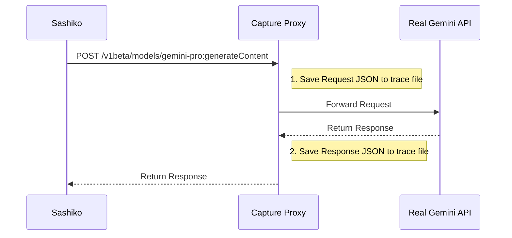

# Design: Gemini API Trace Capture

## Objective
To capture a full trace of interactions between `sashiko` and the Gemini API (requests and responses) during a real execution. This trace will serve as the "golden data" for deterministic regression testing.

## Mechanism: Man-in-the-Middle (MITM) Proxy

Since `sashiko` allows configuring the Gemini API endpoint via the `GEMINI_BASE_URL` environment variable, we can inject a proxy server between `sashiko` and the real Gemini API without modifying the application code.

### Architecture



### Implementation Details

1.  **Proxy Tool**: A simple HTTP server (written in Rust using `axum`) running on `localhost`.
2.  **Configuration**:
    *   Run `sashiko` with `GEMINI_BASE_URL=http://localhost:<PROXY_PORT>`.
    *   The Proxy needs the *real* API Key (passed through or configured in the proxy).
3.  **Storage Format**:
    *   The trace should be stored in a machine-readable format, e.g., `trace_<timestamp>.json` or a sequence of files.
    *   Structure:
        ```json
        [
          {
            "id": 1,
            "timestamp": "...",
            "request": { ... },
            "response": { ... }
          }
        ]
        ```

### Usage Steps

1.  Start the Proxy: `cargo run --bin gemini-recorder` (hypothetical).
2.  Start `sashiko`: `GEMINI_BASE_URL=http://localhost:3000 ./sashiko`.
3.  Trigger the workload (e.g., via `curl` to `sashiko`'s API).
4.  Stop the Proxy.
5.  The trace file is generated.

## Verification
Inspect the generated trace file to ensure it contains:
*   The full prompt sent by `sashiko`.
*   The raw JSON response from Gemini (including `candidates`, `usageMetadata`, etc.).
