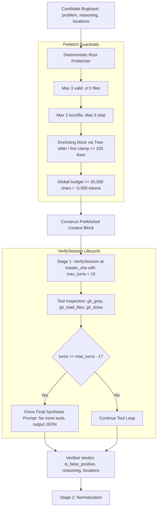

# Design: Bounded Prefetching and Robust Verification in Linux Bug Pipeline

## 1. Context & Motivation

During benchmark evaluation of the Linux bug processing pipeline (`src/workflows/linux_bug.rs`), several candidate bugs (e.g., Bug 2, Bug 8, Bug 10) failed due to exceeding the maximum turns limit (`turns > 50`), while surviving bugs (e.g., Bug 4) took up to 46 turns.

Analysis of database conversation traces revealed four core issues:
1. **Blind Exploration at Turn 0:** Unlike `linux_patch_review`, which injects full function definitions into `<pre_fetched_context>`, `linux_bug`'s `VerifySession` received zero lines of code from mainline (`master_sha`). The model was forced to spend its first 5–10 turns blindly calling `git_read_files` and `git_grep` just to view the reported locations.
2. **Sequential Hypothesis Testing:** Reasoning models (`gemini-3.1-pro-preview`) with internal chain-of-thought operate in single-tool sequential loops (99.6% of tool turns across all reviews were single tool calls). Searching for multiple identifiers sequentially burned 30–40 turns.
3. **The "Prove a Negative" Prompt Trap:** The verification prompt demanded concrete proof of safety across the entire kernel to dismiss a false positive, causing the model to endlessly traverse caller, callee, and destructor call graphs across dozens of driver files.
4. **Hard Bailout in SessionRunner:** When `turns > max_turns`, `SessionRunner` terminated with `anyhow::bail!`, causing `bug_worker` to mark the bug as `failed` and discard all 50 turns of accumulated analysis (`logs = NULL`).

This design specifies a **deterministic, bounded prefetching stage** with strict guardrails against malformed inputs, alongside **graceful session synthesis** and **scoped verification directives**.

---

## 2. Architecture & Pipeline State Transition



---

## 3. Detailed Component Specifications

### 3.1 Bounded Deterministic Prefetcher (`prefetch_bug_locations`)

A dedicated asynchronous Rust function `prefetch_bug_locations(tools: &ToolBox, master_sha: &str, locations: &Option<Value>) -> String` that runs in $<10\text{ms}$ with zero LLM API calls.

#### Guardrail Specifications:
1. **Input Normalization & Safety:**
   - Parse `locations` safely using `Option<Value>`. If `locations` is null, not an array, or empty, return `""` immediately without error.
   - For each location object, sanitize `file`: reject paths containing `..`, absolute paths outside the repo, hidden paths (`.`), and non-source files (only allow extensions `.c`, `.h`).
2. **File Throttling:**
   - Maintain a list of unique files in order of appearance.
   - Truncate the list to **at most 3 distinct files**. Discard subsequent files.
3. **Location Throttling:**
   - At most **2 locations per file**, and **at most 5 locations total**.
4. **Snippet Extraction & Clamping:**
   - Fetch the file content at `master_sha` using `tools.read_file_at_revision(file, master_sha)`. If the file does not exist at `master_sha`, silently ignore it.
   - If `line` is provided ($\ge 1$):
     - Try Tree-sitter enclosing function extraction using `overlapping_definitions`.
     - Clamp the extracted block to **at most 100 lines** centered around `line`.
     - If Tree-sitter finds no enclosing block, take $[\max(1, \text{line} - 30), \text{line} + 50]$ (clamped to 100 lines).
   - If only `function_or_symbol` is provided:
     - Search the file for the function definition and extract up to 100 lines.
5. **Global Character / Token Cap:**
   - Enforce `MAX_BUG_PREFETCH_CHARS = 20,000` ($\approx 5,000$ tokens).
   - If adding a snippet would exceed the budget, append `\n... (Context prefetch limits reached)\n` and stop further extraction.

---

### 3.2 Prompt Integration in `VerifySession`

Inject `<pre_fetched_context>` directly into `VerifySession::initial_user_prompt`:

```markdown
Candidate Vulnerability:
Problem: {problem}
Reasoning: {reasoning}

{prefetched_context_block}

Task:
1. Verify the problem against the mainline code shown above and at commit `{master_sha}`.
2. Scope your verification to the reported functions, immediate error handling paths, and direct caller contracts. Do NOT attempt open-ended whole-kernel call-graph traversals.
3. Determine if the issue is a genuine, reachable defect in the codebase.
4. If the defect is safe or impossible based on local code proof, set "is_false_positive": true.
5. If confirmed, set "is_false_positive": false and refine "relevant_code_locations".
```

---

### 3.3 Graceful Session Synthesis in `SessionRunner`

Instead of abruptly aborting with `anyhow::bail!("Session exceeded max turns limit ({})", self.max_turns)`:
1. When `turns == self.max_turns - 1`:
   - Send a directive to the LLM:
     *"TURN BUDGET EXHAUSTED: You have reached the maximum allowed investigation turns. Do NOT call any more tools. Based on the evidence gathered so far, synthesize your final JSON verdict now."*
   - Clear `request.tools` to `None` for the final turn so the LLM cannot issue further tool calls.
2. If `turns > self.max_turns`:
   - Rather than failing the entire bug, gracefully validate whatever response was emitted or return a fallback unverified outcome, and ensure conversation logs are serialized into `bugs.logs`.

---

### 3.4 Worker Log Persistence

In [`src/worker/bug_worker.rs`](file:///usr/local/google/home/kfree/sashiko/src/worker/bug_worker.rs), ensure that any error caught during bug processing compresses and stores `full_history` into `bugs.logs` before updating `status = 'failed'`.

---

## 4. Verification & Testing Plan

1. **Unit Tests for Prefetcher Guardrails:**
   - Test with malformed `locations` (null, string, invalid paths, `../../passwd`).
   - Test file throttling (>3 files).
   - Test snippet clamping (>100 lines).
   - Test global budget truncation (>20,000 chars).
2. **Integration Test with `SessionRunner`:**
   - Verify that approaching `max_turns` forces synthesis without crashing.
3. **CI Validation:**
   - Run `make check-pr` to verify formatting, clippy, unit tests, and signed commits.
