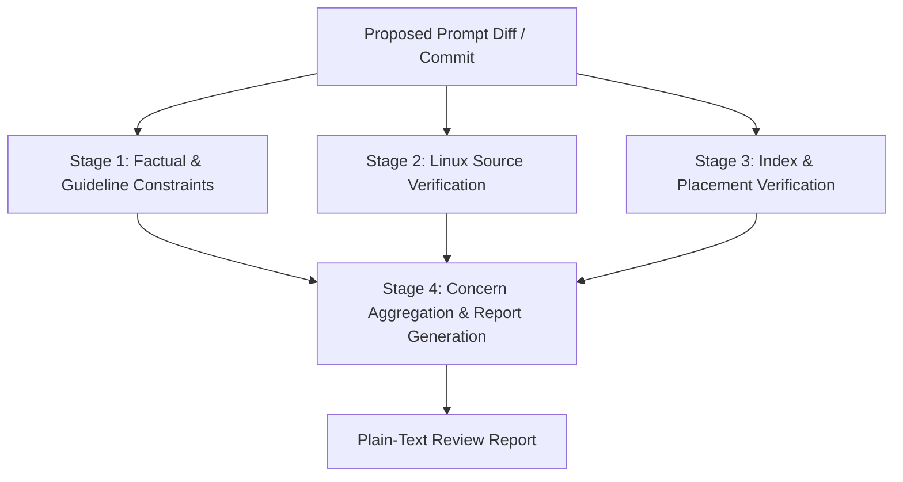

# Design Document: Sashiko Linux Prompt Review Workflow

## 1. Problem Statement & Motivation

Sashiko relies on domain-specific prompt engineering (API guidelines, subsystem internals, technical patterns, invariants, false-positive catalogs) to guide LLMs during Linux kernel patch review. 

When contributors or automated tools propose updates to these prompts, unvetted changes can degrade review quality or break reviewer execution:
1. **Action Instruction Violations:** Prompts might instruct the model to execute unsupported actions (e.g., "compile the kernel", "run kselftest", "search on the web for CVEs"). Sashiko's kernel review engine is autonomous and strictly limited to read-only git repository inspection (`git grep`, `git show`, `git log`, `read_files`, etc.).
2. **Context Pollution with Trivial Facts:** Prompts might include obvious, basic C programming language syntax explanations (e.g., explaining `if` conditions, basic pointer syntax, or loop counters) that consume valuable token budget without adding kernel domain knowledge.
3. **Factual Codebase Discrepancies:** Prompts might reference nonexistent functions, incorrect struct definitions, deprecated macros, or inaccurate locking/concurrency invariants that contradict the real Linux kernel source tree.
4. **Folder Placement & Index Inconsistencies:** Prompts must follow a structured hierarchy:
   - `api/`: Widely used kernel APIs and primitives (e.g., how callers across subsystems should use locking primitives, memory allocators, RCU).
   - `subsystems/`: Subsystem internal mechanics and implementation invariants (e.g., how locking primitives or scheduler dispatchers are internally implemented), which general API users do not need.
   - `generic/`: High-level policies, output formatting, severity definitions, and overall review checklists.
   - `index.md`: Root index file mapping patch triggers to relevant prompts across `api/`, `subsystems/`, and `generic/`.

To automate the review of kernel prompt pull requests and patches, we introduce a dedicated 4-stage declarative workflow in Sashiko.

---

## 2. Architecture & 4-Stage Review Pipeline



### Stage 1: Factual & Guideline Constraints (`stage_1_factual_constraints`)
- **Objective:** Evaluate the proposed prompt text to ensure it contains only factual, domain-relevant information and adheres to Sashiko's review engine constraints.
- **Constraints Checked:**
  - **No Action Instructions:** Must NOT instruct the model to compile code, run build systems, execute scripts, or search the web.
  - **No Trivial Facts:** Must NOT explain generic C language syntax or basic programming concepts.
  - **Factual Integrity:** Must provide concrete invariants, API rules, bug patterns, or anti-patterns.
- **Tools:** `ToolScope::None`.
- **Output:** JSON schema with `concerns` and `dismissed_concerns`.

### Stage 2: Codebase Verification against Linux Source Tree (`stage_2_codebase_verification`)
- **Objective:** Cross-verify technical claims, function signatures, struct fields, macros, and subsystem invariants against the actual Linux kernel source code (e.g., latest Linus tree HEAD).
- **Behavior:**
  - Uses Git tools (`git_grep`, `git_read_files`, `git_find_files`, `git_show`, `git_log`) to check if referenced symbols exist and follow the stated rules.
  - **Safe Fallback:** If verification is not possible (e.g., kernel tree is unavailable, or claims are high-level/conceptual), the stage does not raise false alarms and returns empty concerns.
- **Tools:** `ToolScope::All`.
- **Output:** JSON schema with `concerns` and `dismissed_concerns`.

### Stage 3: Index & Placement Verification (`stage_3_index_placement`)
- **Objective:** Verify that prompt changes are placed in the appropriate directory (`api/`, `subsystems/`, `generic/`) and registered in root `index.md` if necessary.
- **Placement Rules:**
  - `api/`: Guidelines and rules on how callers properly use widely used kernel APIs and primitives (locking primitives, memory allocation, RCU, workqueues, cleanup attributes).
  - `subsystems/`: Internal implementation details and mechanics of kernel subsystems (e.g. how locking primitives or scheduler internals are implemented).
  - `generic/`: High-level prompts describing output formatting, severity assessment, false-positive handling, and core review workflow.
- **Index Rules:**
  - Conditionally loaded prompts in `api/` and `subsystems/` must have matching trigger rules in `index.md`.
  - Prompts in `generic/` are often loaded directly by specific review workflow stages, so `index.md` registration is not required for `generic/` files.
- **Tools:** `ToolScope::None`.
- **Output:** JSON schema with `concerns` and `dismissed_concerns`.

### Stage 4: Concern Aggregation & Report Generation (`stage_4_report_generation`)
- **Objective:** Aggregate concerns from Stages 1-3 and generate a constructive review report formatted in Sashiko's LKML-inspired inline review style.
- **Format:**
  - Concise summary of the prompt change.
  - Clean status if no concerns were found across all 3 analysis stages.
  - Interspersed comments quoting diff hunks with `> +...` followed directly by constructive explanations and questions.
  - Plain-text formatted without Markdown headers, with 78-character line wrapping.
- **Tools:** `ToolScope::None`.
- **Output:** Validated plain-text report.

---

## 3. Data Structures & State Representation

```rust
#[derive(Clone, Debug, Default)]
pub struct LinuxPromptReviewState {
    pub ps_id: String,
    pub p_id: String,
    pub commit_sha: Option<String>,
    pub commit_subject: Option<String>,
    pub target_prompt_diff: String,

    pub stage_1_concerns: Vec<serde_json::Value>,
    pub stage_2_concerns: Vec<serde_json::Value>,
    pub stage_3_concerns: Vec<serde_json::Value>,

    pub all_concerns: Vec<serde_json::Value>,
    pub all_dismissed_concerns: Vec<serde_json::Value>,

    pub report: String,
}
```

---

## 4. Prompt Asset Organization

Prompt templates for the workflow are stored in `prompts/linux_prompts/`:
- `prompts/linux_prompts/README.md`: Overview of the prompt review workflow.
- `prompts/linux_prompts/system.md`: Common system identity and reviewer principles.
- `prompts/linux_prompts/stage1_factual_constraints.md`: Stage 1 guidelines.
- `prompts/linux_prompts/stage2_codebase_verification.md`: Stage 2 verification rules.
- `prompts/linux_prompts/stage3_index_placement.md`: Stage 3 index & 3-folder structure rules (`api/`, `subsystems/`, `generic/`, `index.md`).
- `prompts/linux_prompts/stage4_report_generation.md`: Stage 4 synthesis and LKML formatting rules.
- `prompts/linux_prompts/report-template.md`: Report layout and examples.

---

## 5. Implementation Plan

1. **Design Documentation:** Update `designs/DESIGN_LINUX_PROMPT_REVIEW_WORKFLOW.md`.
2. **Prompt Templates:** Update markdown prompt assets under `prompts/linux_prompts/`.
3. **Workflow Implementation:** Update `src/worker/linux_prompt_workflow.rs` with refined Stage 3 instructions, schema, and tests.
4. **Validation:** Run `make check-pr` to verify all linters, formatting, and unit/integration tests pass.
