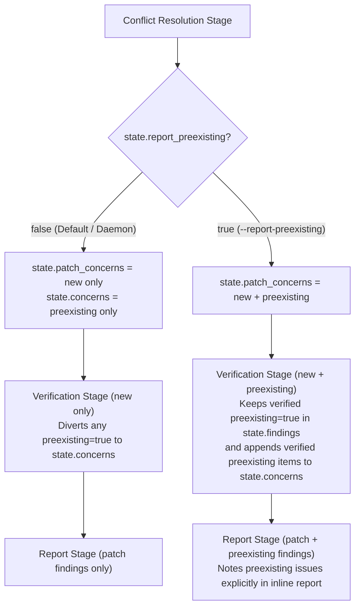

# Design: Full Verification and Reporting for `--report-preexisting` in Local Reviews

## 1. Objective and Problem Statement

### 1.1 Context
When reviewing patches with Sashiko, analysis stages may uncover both:
1. **Patch-introduced regressions** (`"preexisting": false`): defects introduced or triggered by the patch under review.
2. **Pre-existing bugs** (`"preexisting": true`): latent defects already present in the surrounding codebase before the patch was applied.

In server/daemon mode, pre-existing concerns are separated after the `conflict-resolution` stage into `state.concerns` and handed off to the standalone database-backed bug pipeline (`BugWorker` / `linux_bug.rs`), while `verification` and `report` stages process only patch-introduced concerns.

### 1.2 The Problem
In local CLI reviews (`sashiko review --report-preexisting`), there is no daemon database or background `BugWorker`. Because `conflict_resolution_stage` unconditionally diverts `"preexisting": true` concerns out of `state.patch_concerns` and `verification_stage` excludes `"preexisting": true` items from `state.findings`:
1. If a patch has only pre-existing concerns, the workflow exits early after `conflict-resolution`, skipping `verification` and `report` stages completely.
2. Pre-existing concerns in local reviews are never verified against false positives or assigned a calibrated severity.
3. No `Inline Review:` (`review_inline`) report is generated for pre-existing bugs.
4. `print_review_result` in `src/main.rs` only prints a one-line summary (`- <type>: <description>`) from `review.concerns`, discarding the structured `locations` (`file`, `function_or_symbol`, `line`, `code_snippet`, `why_this_location_matters`) and `reasoning` fields.

### 1.3 Goals
1. **Full In-Pipeline Verification & Report Generation**: When `--report-preexisting` is enabled, keep pre-existing concerns in the patch review pipeline through `verification` and `report` stages, matching previous Sashiko behavior without requiring a database or spawning separate per-bug multi-stage pipelines.
2. **Rich CLI Output**: Display verified pre-existing findings with their calibrated severity, exact code locations (`file:line (symbol)`), rationale, and the full `Inline Review:` report.
3. **Zero Impact on Default & Server Workflows**: Keep default behavior (`report_preexisting = false`) completely unchanged so daemon reviews continue routing pre-existing concerns exclusively to the standalone bug pipeline and default local reviews focus strictly on patch-introduced regressions.

---

## 2. Architecture & Data Flow

### 2.1 State and Configuration Plumbing
Add `pub report_preexisting: bool` (defaulting to `false`) across:
- `ReviewOptions` and `WorkerOptions` in `src/local_review.rs`
- `WorkerConfig` and `Worker` in `src/worker/prompts.rs`
- `LinuxPatchReviewState` in `src/workflows/linux_patch_review.rs` (aliased as `SashikoPatchReviewState` in `src/workflows/sashiko_patch_review.rs`)
- CLI flags on `sashiko review` (`src/main.rs`) and `sashiko worker` (`src/main.rs`).

### 2.2 Workflow Stage Behavior (`linux_patch_review.rs` & `sashiko_patch_review.rs`)

1. **`conflict_resolution_stage`**:
   - When `state.report_preexisting == false`:
     - `preexisting: false` concerns go to `state.patch_concerns`.
     - `preexisting: true` concerns are appended to `state.concerns` (`state.concerns.extend(preexisting)`).
   - When `state.report_preexisting == true`:
     - Both `preexisting: false` and `preexisting: true` concerns are placed in `state.patch_concerns` so the workflow does not exit early and passes all candidate concerns to `verification_stage` before populating `state.concerns`.

2. **`verification_stage`**:
   - Prompt instructions explicitly direct the model to validate every concern in `Consolidated Concerns` against the codebase, discard false positives, and set `"preexisting": true` on findings that existed prior to the patch.
   - In `.reduce(...)`:
     - When `state.report_preexisting == false`: findings with `"preexisting": true` are converted to concern objects and appended to `state.concerns`, and excluded from `state.findings`.
     - When `state.report_preexisting == true`: verified `"preexisting": true` findings are appended to `state.concerns` (preserving multi-writer append semantics on `state.concerns` without calling `.clear()`), and all verified findings (both `"preexisting": false` and `"preexisting": true`) are retained in `state.findings`.

3. **`report_stage`**:
   - Receives `state.findings`.
   - Prompt instructions specify that for any finding with `"preexisting": true`, the inline review comment must explicitly note that the issue was not introduced by the patch (e.g., `"This problem wasn't introduced by this patch, but..."`).

### 2.3 CLI Output Rendering (`src/main.rs`)

1. **Patch-Introduced Findings**:
   - Counted and rendered under `Findings:` as before.
   - When no patch-introduced findings exist, prints `No patch-introduced issues found.` if verified pre-existing findings are being reported, or `No issues found.` otherwise.
2. **Pre-existing Findings (when `--report-preexisting` is set)**:
   - When `review.findings` contains verified pre-existing findings (`"preexisting": true`), render a `Pre-existing Findings:` section with severity breakdown (`Critical`, `High`, `Medium`, `Low`), followed by each finding's `[Severity] <problem>`, code locations (`file:line (function_or_symbol)`), and rationale (`severity_explanation`).
   - Render the `Inline Review:` block produced by `report_stage`.
3. **Exit Code**:
   - `result_has_high_or_critical_findings` continues to check `!finding["preexisting"]`, so pre-existing bugs do not cause a non-zero exit code when the patch itself introduces no High/Critical regressions.

---

## 3. Implementation Plan

1. **Step 1: Workflow & Worker Plumbing**:
   - Add `report_preexisting` to `LinuxPatchReviewState`, `WorkerConfig`, `ReviewOptions`, and `WorkerOptions`.
   - Update `conflict_resolution_stage`, `verification_stage`, and `report_stage` in `src/workflows/linux_patch_review.rs` and `src/workflows/sashiko_patch_review.rs`.
   - Add unit tests verifying both `report_preexisting: false` and `report_preexisting: true` reduce behavior.
2. **Step 2: CLI Wiring & Rich Rendering**:
   - Wire `report_preexisting` through `src/main.rs` (`review` and `worker` subcommands).
   - Enhance `print_review_result` in `src/main.rs` to render verified pre-existing findings with code locations and rationale alongside the inline review.
   - Add unit tests for the formatted output and update documentation in `README.md`.
