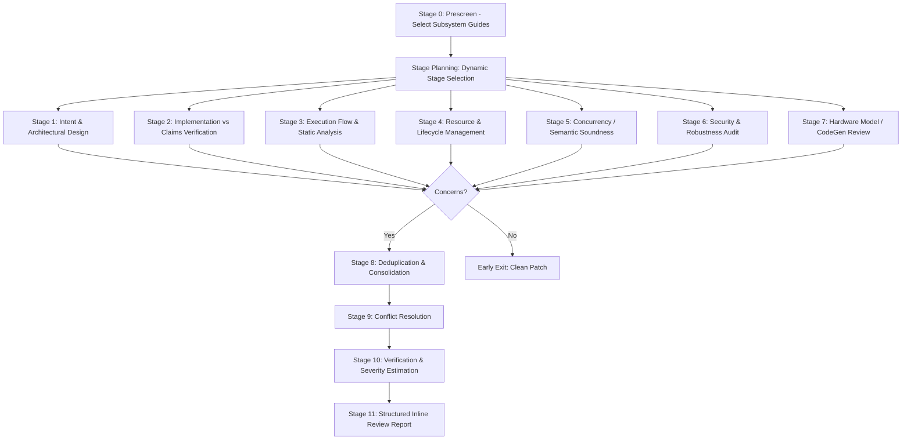

# Design: QEMU and LLVM Code Review Pipelines

## 1. Overview & Motivation

Sashiko was initially developed for deep, multi-stage automated review of Linux kernel patches. The Linux review pipeline uses a declarative DAG of specialized stages (intent analysis, implementation verification, execution flow static analysis, resource management, locking/synchronization, security audit, hardware review, deduplication, conflict resolution, and verification).

Compilers (such as **LLVM**) and systems emulators / hypervisors (such as **QEMU**) have distinct correctness invariants, bug patterns, execution models, and review cultures:

- **QEMU**: Virtual machine monitor and system emulator in C. Defects often manifest as guest-to-host escapes, out-of-bounds MMIO reads/writes, integer overflows in guest packet/command headers, unvalidated DMA buffer lengths, QOM (QEMU Object Model) lifecycle errors, coroutine/AioContext reentrancy races, missing Big QEMU Lock (BQL) acquisition, migration stream deserialization bugs (VMState), and Error object memory leaks.
- **LLVM**: Production compiler infrastructure in C++. Defects often manifest as compiler crashes (unchecked `dyn_cast` null dereferences, iterator invalidations during AST/IR transformations), silent miscompilations (unsound algebraic simplifications, invalid poison/undef assumptions, SSA dominance violations), infinite optimization loops in InstCombine, assertion failures in instruction selectors or register allocators, and linker relocation corruptions in `lld`.

This design extends Sashiko to support dedicated review pipelines for **QEMU** and **LLVM**, complete with specialized prompt suites, modular subsystem triggers, declarative review workflows, project auto-detection, and small 5-case benchmark datasets for end-to-end evaluation.

---

## 2. Domain Architectures & Subsystem Taxonomies

### 2.1 QEMU Subsystem Taxonomy

| Subsystem | Key Directories & Files | Common Bug Patterns & Invariants |
|---|---|---|
| **`qom` / Object Lifecycle** | `qom/`, `hw/core/qdev*`, `include/hw/qdev*` | Missing `.class_size` in `TypeInfo` causing heap overflow on class init; incorrect `instance_init` vs `realize`; missing cleanup in `unrealize`; unbalanced `object_ref`/`object_unref`. |
| **`memory` / MMIO** | `system/memory.c`, `include/exec/memory.h` | Guest MMIO handler bounds checking; missing size/offset validation; integer overflow in `addr + size`; non-power-of-two access handling. |
| **`dma` / AddressSpace** | `system/dma-helpers.c`, `include/sysemu/dma.h` | Guest-controlled DMA lengths; unmapped physical memory access; bounce buffer exhaustion; DMA unmapping on error paths. |
| **`virtio` / Vhost** | `hw/virtio/`, `include/hw/virtio/` | Virtqueue descriptor validation; out-of-bounds guest ring indexing; unvalidated bounce buffer sizes; event index notification suppression. |
| **`migration` / VMState** | `migration/`, `include/migration/` | VMState stream format compatibility; subsection preconditions; missing post-load validation of guest-controlled fields; memory leaks on migration cancellation. |
| **`block` / Storage** | `block/`, `blockdev.c`, `include/block/` | Coroutines yielding while holding mutexes; AioContext thread safety; BlockDriverState reference counting; un-drained I/O on device teardown. |
| **`hw/net` / Networking** | `hw/net/`, `net/` | Packet length bounds checks (`tx_len > BUFSZ_MAX`); header checksum truncation; ring buffer wrap-around; guest descriptor chaining loops. |
| **`hw/scsi` / `hw/nvme`** | `hw/scsi/`, `hw/nvme/` | Mutable guest state (e.g. `blocksize` changed via MODE SELECT while request is in flight); PRP/SGL list parsing; DMA scatter-gather list leaks. |
| **`concurrency` / BQL** | `util/rcu.c`, `system/cpus.c` | Calling blocking operations without releasing BQL; reentrancy in MMIO callbacks; timer/BH callback execution after object destruction. |
| **`error-handling`** | `util/error.c`, `include/qapi/error.h` | Leaking `Error *` when ignoring or overwriting errors; forgetting `ERRP_GUARD()`; returning wrong boolean status on error. |

### 2.2 LLVM Subsystem Taxonomy

| Subsystem | Key Directories & Files | Common Bug Patterns & Invariants |
|---|---|---|
| **`transforms` / Optimizations** | `llvm/lib/Transforms/` (`InstCombine`, `Vectorize`, `Scalar`) | Unsound algebraic rewrites; ignoring `nuw`/`nsw`/`exact` flags; folding into `undef`/`poison` improperly; infinite rewrite loops (ping-pong); operand type mismatches in newly constructed instructions. |
| **`analysis`** | `llvm/lib/Analysis/` (`ValueTracking`, `ScalarEvolution`, `MemorySSA`) | Miscalculating `KnownBits` or `ConstantRange`; unsound alias analysis assumptions; invalid handling of pointer provenance. |
| **`ir-core` / SSA Invariants** | `llvm/lib/IR/`, `llvm/include/llvm/IR/` | Violating SSA dominance (using operand before its definition dominates use); creating malformed `PHINode`s; iterator invalidation when deleting instructions while iterating over `BasicBlock`. |
| **`codegen` / SelectionDAG & GlobalISel** | `llvm/lib/CodeGen/` | Unchecked `dyn_cast` returning null; dead/kill flag corruption; register class mismatches; frame lowering stack offsets; invalid machine instruction iterators (`MI == MBB.end()`). |
| **`targets` / Backends** | `llvm/lib/Target/` (`X86`, `AArch64`, `RISCV`, `AMDGPU`) | Calling convention register clobbers; wrong DWARF register mapping in `.td` files; vector legalizer type splits; missing shadow call stack / PAC protections. |
| **`clang-frontend` / AST & Sema** | `clang/lib/AST/`, `clang/lib/Sema/`, `clang/lib/Parse/` | Unchecked null AST nodes; state corruption on failed template or overload lookup; dangling `SourceLocation`; invalid type conversions in builtins. |
| **`lld` / Linker** | `lld/ELF/`, `lld/COFF/`, `lld/MachO/` | Relocation calculation errors; section flag merging conflicts; IFUNC and GOT authentication handling; synthetic symbol resolution. |

---

## 3. Review Workflow Design for QEMU and LLVM

Both pipelines adopt the 11-stage declarative workflow established for the Linux kernel, with domain-specific stage instructions, schemas, and subsystem knowledge modules:



### 3.1 QEMU Pipeline Stages

1. **Stage 1 (Intent & Architecture)**: Evaluates high-level virtualization and device architecture intent, QOM hierarchy, QAPI schema compatibility, command-line compatibility, and migration protocol impacts.
2. **Stage 2 (Implementation Verification)**: Verifies that claimed features, register operations, and device capabilities match the commit message. Checks for omitted callbacks in `MemoryRegionOps` or `DeviceClass`.
3. **Stage 3 (Execution Flow)**: Traces error handling paths, `goto out` unwinding, bounds checks on guest-controlled inputs, null dereferences, and integer wraparound in address arithmetic.
4. **Stage 4 (Resource Management & QOM Lifecycle)**: Audits `object_ref`/`object_unref`, `g_malloc` vs `g_try_malloc` (abort prevention), `realize`/`unrealize` teardown symmetry, and timer/BH lifecycle.
5. **Stage 5 (Concurrency, BQL & Coroutines)**: Analyzes BQL acquisition/release, coroutine yields across locks, AioContext locking rules, reentrancy vulnerabilities during MMIO/DMA handling, and bottom-half race conditions.
6. **Stage 6 (Security & Guest Attack Surface)**: Scrutinizes guest-to-host attack surfaces: out-of-bounds MMIO read/write, DMA buffer overflows, unvalidated packet/command lengths from guest RAM, and VMState post-load validation.
7. **Stage 7 (Virtual Hardware & Device Model)**: Rigorously verifies hardware state machines, reset behavior (`DeviceReset`), interrupt line assertions/deassertions, register write masks (`wmask`), and endianness conversion (`le32_to_cpu`).
8. **Stages 8-11**: Deduplication, conflict resolution against dismissed hypotheses, verification with anti-charity checks, and generation of a structured review report.

### 3.2 LLVM Pipeline Stages

1. **Stage 1 (Intent & Architecture)**: Evaluates compiler design rationale, pass pipeline order, IR construct design, and backwards compatibility with existing bitcode.
2. **Stage 2 (Implementation Verification)**: Compares commit claims with code modifications; checks that optimization folds handle all operand permutations (commutativity) and that test cases cover all mutated paths.
3. **Stage 3 (Execution Flow & Cast Safety)**: Static analysis of control flow; checks for unchecked `dyn_cast<T>` resulting in null dereference, unhandled enum cases in `switch`, and missing return values.
4. **Stage 4 (Lifetime & Memory Safety)**: Audits iterator invalidation during AST/IR transformations (`for (auto &I : BB) { I.eraseFromParent(); }`), RAII ownership, `ValueHandle` tracking, and `Use` list manipulation.
5. **Stage 5 (Correctness & Semantic Soundness)**: Rigorous verification of algebraic transformations: poison/undef preservation, `nsw`/`nuw`/`exact` flags, type bitwidth matching in `CreateICmp`/`CreateSelect`, SSA dominance rules, and termination proofs to prevent infinite InstCombine loops.
6. **Stage 6 (Robustness & Diagnostics)**: Checks that malformed source or unexpected IR triggers graceful diagnostics rather than compiler crashes or assertion failures in release builds; checks recursion depth limits.
7. **Stage 7 (Code Generation & Backend Review)**: Inspects target lowering, SelectionDAG node combinations, MachineInstr operand types, physical vs virtual register constraints, and calling convention clobbers.
8. **Stages 8-11**: Deduplication, conflict resolution, verification against the codebase, and generation of a structured review report.

---

## 4. Prompt Repository Structure

We establish dedicated prompt directories under `third_party/prompts/`:

```text
third_party/prompts/
├── kernel/                    # Existing Linux kernel prompts
├── qemu/                      # QEMU review prompts
│   ├── review-core.md         # QEMU analysis protocol and core rules
│   ├── technical-patterns.md  # QEMU bug patterns (QOM, DMA, MMIO, BQL)
│   ├── false-positive-guide.md# QEMU false positive elimination guide
│   ├── inline-template.md     # QEMU review output formatting template
│   └── subsystem/
│       ├── subsystem.md       # Trigger index for QEMU subsystems
│       ├── block.md           # Block layer, coroutines, AioContext
│       ├── concurrency.md     # BQL, RCU, BHs, thread safety
│       ├── dma.md             # DMA helpers, AddressSpace, bounce buffers
│       ├── error-handling.md  # Error **errp, ERRP_GUARD, leak rules
│       ├── memory.md          # MemoryRegionOps, MMIO bounds, subpages
│       ├── migration.md       # VMState, subsection preconditions, post-load
│       ├── qom.md             # Object model, TypeInfo, class_size, realize
│       └── virtio.md          # Virtqueue, vring, descriptors, indices
└── llvm/                      # LLVM review prompts
    ├── review-core.md         # LLVM analysis protocol and compiler invariants
    ├── technical-patterns.md  # LLVM patterns (SSA, casts, iterators, poison)
    ├── false-positive-guide.md# LLVM false positive elimination guide
    ├── inline-template.md     # LLVM review output formatting template
    └── subsystem/
        ├── subsystem.md       # Trigger index for LLVM subsystems
        ├── analysis.md        # ValueTracking, ScalarEvolution, AliasAnalysis
        ├── clang-frontend.md  # Clang AST, Sema, Lex, diagnostics
        ├── codegen.md         # SelectionDAG, GlobalISel, MachineInstr
        ├── ir-core.md         # LLVM IR, Types, Constants, Instructions
        ├── lld.md             # Linker ELF/COFF/MachO/Wasm, relocations
        ├── targets.md         # Target backends (X86, AArch64, RISCV, AMDGPU)
        └── transforms.md      # InstCombine, SimplifyCFG, Vectorize, Scalar
```

All prompt files are embedded into the Sashiko binary at build time by `build.rs` and installed into the local prompt bundle on first execution.

---

## 5. Multi-Project Runtime Integration

### 5.1 Project Auto-Detection & Configuration

Sashiko resolves the active project using the following precedence:

1. **Explicit CLI Flag**: `--project <qemu|llvm|kernel>` (or `--pipeline <qemu|llvm|kernel>`).
2. **Explicit Configuration**: `settings.project.name` (e.g. `[project] name = "qemu"`).
3. **Repository Tree Heuristics**: Inspected against the target git repository or worktree:
   - **QEMU**: Contains `qemu-options.hx`, `include/hw/qdev-core.h`, or `qapi/qmp-dispatch.c`.
   - **LLVM**: Contains `llvm/include/llvm/IR/Instructions.h` or `llvm-project` directory structure.
   - **Kernel (Default)**: Contains `include/linux/kernel.h` or `Kconfig`.

### 5.2 Dynamic Prompt Path Resolution

When `--prompts` is not explicitly passed, Sashiko resolves the prompt directory from the bundled assets based on the active project:

- `Project::Kernel` -> `prompt_bundle::default_kernel_prompts_path()`
- `Project::Qemu` -> `prompt_bundle::default_qemu_prompts_path()`
- `Project::Llvm` -> `prompt_bundle::default_llvm_prompts_path()`

### 5.3 Workflow Dispatch

The review worker dispatches to the project's declarative workflow:
```rust
match project {
    Project::Kernel => build_kernel_review_workflow_with_options(turns, temp),
    Project::Qemu => build_qemu_review_workflow_with_options(turns, temp),
    Project::Llvm => build_llvm_review_workflow_with_options(turns, temp),
}
```

---

## 6. Small Benchmark Suites (5 Cases Each)

To allow fast end-to-end testing, we distill 5 high-confidence, diverse historical defect cases each for QEMU and LLVM from the 500-case datasets:

### 6.1 QEMU Small Benchmark (`benchmarks/qemu/benchmark_small.json`)

1. **`356c4c441ec01910314c5867c680bef80d1dd373`** (`hw/scsi`): Out-of-bounds heap read in `scsi_disk_emulate_write_same()` due to mutable `blocksize`.
2. **`33a71a68c6e137c80c9f6a7370d546404ed38513`** (`hw/arm`): Missing `.class_size` in `TypeInfo` causing heap memory corruption on class init.
3. **`0d148eaf5a3eb14469b536e37bb1936fd0085f03`** (`hw/intc`): Unchecked guest MMIO CPU index leading to out-of-bounds lookup and NULL pointer dereference.
4. **`b43848a1005cec6e952ce2b3268725a688aa74c6`** (`hw/net`): Transmit packet size not bounds-checked against `BUFSZ_MAX`, causing out-of-bounds read in `qemu_send_packet()`.
5. **`e41b711485e5b2dcf747ef27cf252a940e09247f`** (`virtio`): Missing migration post-load validation in `virtio_net_rss_post_load()`, causing NULL pointer dereference.

### 6.2 LLVM Small Benchmark (`benchmarks/llvm/benchmark_small.json`)

1. **`943e92efde269162465e9125d20992965421568d`** (`llvm/InstCombine`): Type mismatch in `foldICmpOrConstant` comparison generating null constant with mismatched type and triggering assertion failure.
2. **`cd67cfecb1a154d0759783ae926f8b44c104d7d3`** (`clang`): Uncleared `OperatorNew` state on secondary overload lookup failure in `SemaCoroutine.cpp` causing spurious parameter mismatch error.
3. **`99f7018958ed3daf2abf8d49178c24fbf1eb1010`** (`llvm/CodeGen`): Unchecked null `VNInfo` pointer in `Rematerializer.cpp` causing segmentation fault crash.
4. **`255162ae0ebe805df151c5c4b48e1a47a5dd74f0`** (`llvm/Target/RISCV`): Instruction iterator past the end (`MBB.end()`) dereferenced in `emitSCSEpilogue`.
5. **`417d2d7ce694acfa09a7d950cf1c5c41796eb313`** (`lld`): Non-preemptible IFUNC symbol requesting AUTH GOT entry triggers assertion failure or invalid non-authenticated GOT generation.

---

## 7. Verification Plan

1. **Compilation & Unit Testing**:
   - Verify prompt bundle build with `cargo build`.
   - Run `cargo test` and `make lint`.
2. **CLI Review Verification**:
   - Run `sashiko review --no-ai` on commits in the local QEMU repository to verify worktree creation, commit checkout, patch extraction, and QEMU workflow planning.
   - Run `sashiko review --no-ai` on commits in the local LLVM repository to verify LLVM workflow planning.
3. **Benchmark Tool End-to-End**:
   - Validate `cargo run --bin benchmark -- --file benchmarks/qemu/benchmark_small.json --repo /usr/local/google/home/kfree/qemu --analyze-only` against the database.
   - Validate `cargo run --bin benchmark -- --file benchmarks/llvm/benchmark_small.json --repo /usr/local/google/home/kfree/llvm-project --analyze-only`.
