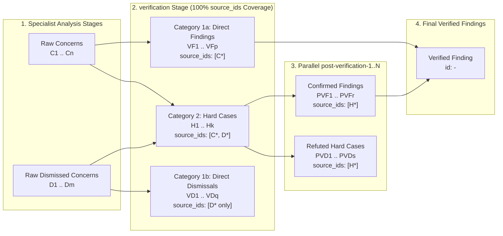

# Design: Review Map, Deterministic Concern Lineage, and Prompt Provenance

## 1. Objective and Problem Statement

### 1.1 Context
In Sashiko's multi-stage patch review workflows (`src/workflows/linux_patch_review.rs` and `src/workflows/sashiko_patch_review.rs`), up to seven specialist analysis stages run in parallel after `pre-screen`, followed by `verification` (triage into Category `1a` direct findings, Category `1b` direct dismissals, and Category `2` hard cases), up to ten parallel `post-verification-N` stages, and `report`.

Previously, the only built-in way to inspect how a review arrived at its conclusions was the **Raw Log** view (`#/log/<review_id>`), which renders the concatenated multi-stage LLM conversation transcript.

### 1.2 Problems with Raw Log Inspection
1. **Excessive Verbosity:** A typical review transcript spans 10–20 stage invocations, dozens of tool calls, and tens of thousands of tokens. Answering simple questions—such as *"Did any specialist stage notice the missing unlock on the error path?"*, *"Why was concern X dismissed?"*, or *"Which prompt files were loaded?"*—requires scrolling and searching through the entire raw log.
2. **Implicit Stage-to-Stage Lineage:** While `append_stage_items_with_prompts` attaches `source_stage` and `prompts_read` to raw items, `verification` merges and rewrites concerns/dismissed concerns into `findings[]`, `hard_cases[]`, and `dismissed_concerns[]` without machine-readable back-references to the raw candidate IDs. Consequently, there is no deterministic graph linking raw specialist stage outputs (`C*` / `D*`) to their consolidation fate (`1a`, `1b`, or `H*`) and final `post-verification` outcome.
3. **Unverified Accounting in Consolidation:** Without deterministic input IDs and a validator check, `verification` could theoretically omit a raw candidate from all three output arrays (`findings`, `hard_cases`, `dismissed_concerns`) without triggering a validation retry.
4. **Lack of Per-Stage Transcript Slicing & Prompt Inventory:** The workflow engine aggregates total turns and tokens across the entire workflow run, but does not record per-stage turn counts, skipped status, or slice indices into `reviews.logs`, nor does it expose a structured manifest of base, pre-screen, stage-exclusive, and dynamically read prompt files.

### 1.3 Design Goals
1. **Single-Screen Review Map (`#/map/<review_id>`):** Provide a high-density, single-screen overview accessible via **`View Review Map`** right before **`View Raw Log`** on every review card.
2. **Deterministic ID Lineage & 100% Accounting Guardrails:**
   - Stamp deterministic short IDs on all raw specialist concerns (`C1..Cn`) and dismissed concerns (`D1..Dm`).
   - Require `verification` to emit `"source_ids": ["C1", "D2", ...]` on every output item across `findings`, `hard_cases`, and `dismissed_concerns`, and enforce in `validate_verification_stage_output` that **every** input `C1..Cn` and `D1..Dm` is referenced at least once (and that Category `1b` `dismissed_concerns` only reference `D*` IDs, never `C*` IDs).
   - Stamp deterministic IDs (`VF1..`, `VD1..`, `H1..Hk`) on `verification` outputs and require each `post-verification-N` stage to emit `"source_ids": ["H1", ...]` referencing the hard case IDs in its batch, validated by `validate_post_verification_batch_output`.
   - Mint a permanent `<project>-<uuid>` (`uuid::Uuid::new_v4()`) on every verified finding in `findings[]`.
3. **Prompt Provenance & Per-Stage Transcript Slicing:**
   - Record a `StageRunRecord` for every executed or skipped stage in `WorkflowEngine`, including exact turn counts, token usage, `prompts_read`, and `[history_start, history_end)` indices into `reviews.logs`.
   - Clicking any stage pill in the Review Map opens an inline drawer displaying **only** that stage's LLM conversation slice from `reviews.logs`.
4. **Zero Database Schema Migrations:** Embed the structured `review_map` object directly inside `final_output` (`ai_interactions.output_raw`), which is already Zstd-compressed and returned by `/api/review?id=<id>`.

---

## 2. Architecture & Lineage Data Model



### 2.1 Deterministic Stage Artifact IDs

| Stage | Collection | ID Format | Upstream Reference Field | Downstream Fate |
| :--- | :--- | :--- | :--- | :--- |
| Specialist Stages (`goal`, `implementation`, `execution-flow`, `resources`, `locking`, `security`, `hardware`) | `state.all_concerns` | `C1` .. `Cn` | `source_stage`, `prompts_read` | Must appear in `verification` (`VF*` or `H*`) |
| Specialist Stages | `state.all_dismissed_concerns` | `D1` .. `Dm` | `source_stage`, `prompts_read` | Must appear in `verification` (`VD*` or `H*`) |
| `verification` | `findings[]` (Category `1a`) | `VF1` .. `VFp` | `source_ids: ["C1", ...]` | Promoted directly to final `findings[]` with `<project>-<uuid>` |
| `verification` | `dismissed_concerns[]` (Category `1b`) | `VD1` .. `VDq` | `source_ids: ["D1", ...]` | Terminal `Dismissed (1b)` |
| `verification` | `hard_cases[]` (Category `2`) | `H1` .. `Hk` | `source_ids: ["C2", "D1", ...]` | Routed to `post-verification-1..N` (`assigned_stage`) |
| `post-verification-1..N` | `findings[]` | `PVF1` .. `PVFr` | `source_ids: ["H1", ...]` | Promoted to final `findings[]` with `<project>-<uuid>` |
| `post-verification-1..N` | `dismissed_concerns[]` | `PVD1` .. `PVDs` | `source_ids: ["H2", ...]` | Terminal `Refuted in Post-Verification` |

### 2.2 Validator Invariants

1. **`validate_verification_stage_output`:**
   - Collect the set of valid concern IDs $C = \{c.\text{id} \mid c \in \text{state.all\_concerns}\}$ and valid dismissed concern IDs $D = \{d.\text{id} \mid d \in \text{state.all\_dismissed\_concerns}\}$.
   - Every item in `output.findings`, `output.hard_cases`, and `output.dismissed_concerns` must have a non-empty `source_ids: Vec<String>` where every ID belongs to $C \cup D$.
   - **Category 1a Uncontested Rule:** An item in `output.findings` (Category `1a`) may **only** reference IDs in $C$. Any contested concern ($C_i + D_j$) or promoted dismissal ($D_j$) must be placed in `hard_cases`.
   - **No Unaudited Concern Drop Rule:** An item in `output.dismissed_concerns` (Category `1b`) may **only** reference IDs in $D$. If an item in `output.dismissed_concerns` references any ID in $C$, validation fails with an actionable error instructing the model that any concern $C_i$ that is contested or believed to be a false positive must be placed in `hard_cases` (`SpeculativeOrContested`) for tool-assisted verification rather than dropped in Category `1b`.
   - **100% Coverage Rule:** The union of `source_ids` across all items in `output.findings`, `output.hard_cases`, and `output.dismissed_concerns` must equal $C \cup D$. If any input ID is missing, validation fails and lists the exact unaccounted IDs (e.g., `["C3", "D2"]`) so the LLM retry includes them.
   - **Prompt Cache Determinism:** When `record_verified_findings` mints a random `<project>-<uuid>` (`Uuid::new_v4()`) on confirmed findings in `state.findings`, trailing stages (`report_stage`, `summary_stage`) strip `"id"` and `"finding_id"` via `serialize_findings_for_prompt` before rendering `{{findings}}` so `CachingAiProvider` request hashes remain deterministic across reruns.

2. **`validate_post_verification_batch_output`:**
   - Given the batch's expected hard case IDs $H_{\text{batch}} = \{h.\text{id} \mid h \in \text{batch}\}$, every item in `output.findings` and `output.dismissed_concerns` must have a non-empty `source_ids: Vec<String>` subset of $H_{\text{batch}}$.
   - The union of `source_ids` across `output.findings` and `output.dismissed_concerns` must cover every ID in $H_{\text{batch}}$ (allowing multiple $H_i$ in a batch to be merged into a single finding or dismissal via `source_ids`).

---

## 3. Workflow Engine Telemetry & `review_map` Schema

### 3.1 `StageRunRecord` in `src/workflow/`
`StageOutcome` and `WorkflowOutcome` are extended with `StageRunRecord`:

```rust
#[derive(Debug, Clone, Serialize, Deserialize, PartialEq, Eq)]
pub struct StageRunRecord {
    pub name: String,
    pub skipped: bool,
    pub turns: usize,
    pub tokens_in: usize,
    pub tokens_out: usize,
    pub tokens_cached: usize,
    pub prompts_read: Vec<String>,
    pub history_start: usize,
    pub history_end: usize,
}
```

When `Worker::run` constructs `self.global_history` (which begins with 1 system prompt entry before `outcome.history` is appended), it shifts `history_start` and `history_end` by `+1` to produce exact `[log_start, log_end)` indices into `reviews.logs`.

### 3.2 `review_map` JSON Payload in `final_output`

```json
{
  "version": 1,
  "project": "linux",
  "prompts": {
    "base": ["README.md", "false-positives-guide.md"],
    "pre_screen": ["subsystem/net.md", "patterns/locking.md"],
    "stage_guides": {
      "goal": ["stage/goal.md"],
      "locking": ["stage/locking.md", "patterns/rcu.md"],
      "verification": ["severity.md"]
    },
    "tool_read": [
      { "path": "subsystem/bpf.md", "stages": ["security"] }
    ]
  },
  "stages": [
    {
      "name": "pre-screen",
      "skipped": false,
      "turns": 1,
      "tokens_in": 4120,
      "tokens_out": 180,
      "tokens_cached": 3000,
      "prompts_read": [],
      "concerns_count": 0,
      "dismissed_count": 0,
      "log_start": 1,
      "log_end": 3
    }
  ],
  "raw_concerns": [ ... ],
  "raw_dismissed_concerns": [ ... ],
  "verification": {
    "findings": [ ... ],
    "hard_cases": [ ... ],
    "dismissed_concerns": [ ... ]
  },
  "post_verification": {
    "findings": [ ... ],
    "dismissed_concerns": [ ... ]
  },
  "threads": [
    {
      "thread_id": "T1",
      "outcome": "finding",
      "finding_id": "linux-550e8400-e29b-41d4-a716-446655440000",
      "severity": "High",
      "preexisting": false,
      "locations": [{ "file": "net/core/sock.c", "line": 418, "symbol": "sk_free()" }],
      "raw_concern_ids": ["C1", "C3"],
      "raw_dismissed_ids": ["D1"],
      "verification_kind": "hard_case",
      "verification_id": "H1",
      "post_verification_stage": "post-verification-1",
      "post_verification_id": "PVF1"
    }
  ]
}
```

---

## 4. Web UI Design (`#/map/<review_id>`)

### 4.1 Entry Point
In `static/index.html`, each review card header renders:
```text
Review #10 (Patch 2) [INLINE]   View Review Map · View Raw Log
```
Clicking **`View Review Map`** navigates to `#/map/<review_id>`.

### 4.2 Simplified Layout Matching Sashiko Visual Style
1. **Header & Metadata Section:**
   - Standard `patchset-header` with patchset/patch subject, Review ID, model, token summary, and `prompts_hash`.
   - Pre-screen guides (`prompts.pre_screen`) are displayed inline right after the `pre-screen` stage output in the Stages table; per-stage static and tool-read guides appear in each stage row's `Prompts` column.
2. **Findings & Concerns Table (`Issue` | `Stages` | `Outcome`):**
   - Sorted with confirmed findings first (ordered by severity `Critical` > `High` > `Medium` > `Low`), followed by hard cases refuted in `post-verification`, followed by `1b` direct dismissals.
   - Collapsed rows show only the 1-line issue title, the chronological list of stage tags (`locking`, `verification`, `post-verification-1`), and the final outcome (`High`, `Refuted`, `Dismissed`).
3. **Expandable Issue Card (`Pipeline History` + `Code Trace`):**
   - **Pipeline History:** Chronological progression across stages (`Raised concern` / `Dismissed in stage` -> `verification` -> `post-verification-N` confirmation or refutation), each with a `View stage log` link. For escalated hard cases (`H*`), `verification` displays `verification_question` and, whenever `verification` merged multiple concerns, resolved competing signals, or promoted a standalone dismissal, also displays the synthesized `concern_arguments` and `dismissal_arguments` (omitting `concern_arguments` only for a single uncontested concern whose reasoning is already shown in the immediately preceding step).
   - **Code Trace:** Single clean container listing numbered call-stack/proof locations (`file:line (symbol)`), explanation, and dedented code snippets.
4. **Stages Table (`Stage` | `Turns` | `Tokens (In / Cached / Out)` | `Prompts` | `Output`):**
   - Lists active stages in execution order (with skipped stages summarized on a muted footer line).
   - Clicking any stage row expands an inline transcript drawer rendering only `logs.slice(stage.log_start, stage.log_end)`.

