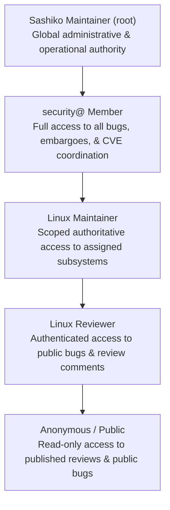
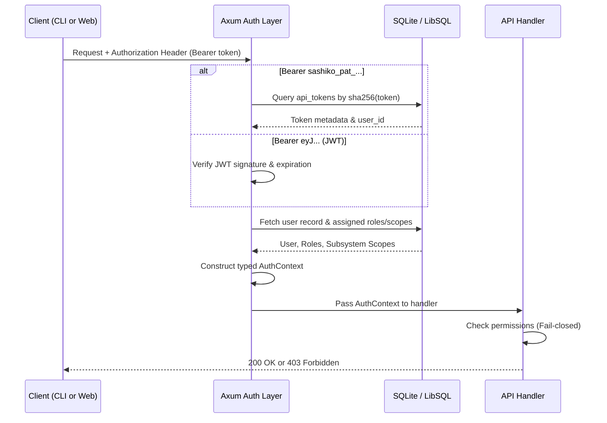

# Design: Role-Based Access Control (RBAC) & Scoped ACL System

## Status
Proposed

## Context & Motivation
Sashiko ingests, reviews, and tracks security defects, static analysis findings, and pre-existing vulnerabilities across the Linux kernel codebase. Kernel vulnerabilities—especially zero-days, concurrency races, and memory corruption bugs prior to public patch submission—represent highly critical assets.

In `../bugrepo`, authorization was modeled with a rudimentary single-level JWT mechanism: an email was verified through a magic link, and an authenticated user had global access unless authorization was disabled completely (`disable_auth = true`).

Sashiko requires a sophisticated, production-grade Access Control List (ACL) and Role-Based Access Control (RBAC) architecture tailored for the Linux kernel development lifecycle. Different kernel actors have distinctly different scopes of trust, operational responsibilities, and visibility constraints:
- **Platform Maintainers (`root`)** must administer worker lifecycles, LLM tokens, configurations, and database state.
- **Kernel Security Team (`security@`)** requires global visibility into all subsystems, especially embargoed vulnerabilities, zero-day defects, and pre-disclosure bug reports.
- **Kernel Subsystem Maintainers** have authoritative jurisdiction over their specific subsystems (e.g., `net/*`, `fs/btrfs`), but should not have write authority or embargo access to unrelated trees.
- **Kernel Reviewers** participate in public review, proposing duplicate linkages and submitting technical feedback without write authority over bug status or embargoed records.
- **Unauthenticated / Public Users** should be able to safely consume public, non-embargoed review results without leaking internal prompts, API quotas, or embargoed security findings.

This document designs an idiomatic, secure, fail-closed, and type-driven RBAC system for Sashiko.

---

## Roles & Permission Model

### 1. The Role Hierarchy

Sashiko defines four core roles, augmented by unauthenticated anonymous access:



#### A. Sashiko Maintainer (`root`)
- **Audience**: Platform operators and DevOps infrastructure engineers.
- **Jurisdiction**: Global platform and data layer.
- **Capabilities**:
  - Full read/write/delete access across the entire database.
  - Server configuration, worker daemon management, and database migrations.
  - User and role provisioning; issuing and revoking API keys.
  - LLM provider management, token budget overrides, and benchmark execution.
  - System-wide audit log access.

#### B. `security@` Member (Full Kernel Access)
- **Audience**: Members of the kernel security team (e.g., `security@kernel.org` or organizational product security incident response teams).
- **Jurisdiction**: Unrestricted across all Linux kernel subsystems and modules.
- **Capabilities**:
  - Global read/write access to **all** bugs, including pre-disclosure and embargoed issues.
  - Ability to adjust or override defect `Severity` and `Mainline Status`.
  - Permission to view raw AI conversation logs, reproduction traces, and prompts.
  - Coordination of CVE tracking and embargo timeline management.
  - Unilateral authority to mark bugs as `duplicate`, `fixed`, or `dismissed`.

#### C. Linux Maintainer
- **Audience**: Designated maintainers of specific kernel subsystems (e.g., netdev, Btrfs, DRM, tracing).
- **Jurisdiction**: Scoped strictly to assigned subsystem paths and hierarchies (e.g., `net/*`, `fs/btrfs`, `drivers/gpu/drm/i915`).
- **Capabilities**:
  - Full read/write authority for bugs within their assigned subsystem scope:
    - Change status (`open`, `fixed`, `dismissed`, `duplicate`).
    - Merge duplicate bugs pointing to canonical issues in their subsystem.
    - Trigger re-runs of analysis pipelines on relevant patchsets or git SHAs.
  - Read-only access to public bugs in other subsystems.
  - Zero access to embargoed bugs outside their subsystem scope.

#### D. Linux Reviewer
- **Audience**: Kernel developers, regular contributors, and community reviewers.
- **Jurisdiction**: Public kernel bugs and patch reviews.
- **Capabilities**:
  - Read access to all public, verified, non-embargoed bug reports and patch reviews.
  - Ability to submit review comments, attach external discussion links (e.g., Lore links), and propose duplicate candidates.
  - Trigger review requests on patchsets submitted by themselves or public mailing lists.
  - No permission to change bug status, dismiss issues, or view embargoed bugs.

#### E. Anonymous / Public
- **Audience**: External consumers, mailing list observers, and public dashboards.
- **Jurisdiction**: Published, non-embargoed artifacts.
- **Capabilities**:
  - Read-only access to `/health`, `/api/config`, public patchsets, and non-embargoed bugs.
  - AI reasoning logs and worker execution traces are stripped and withheld.

---

## Permission Matrix

| Operation / Capability | Anonymous | Linux Reviewer | Linux Maintainer (Scoped) | security@ Member | Sashiko Root |
| :--- | :---: | :---: | :---: | :---: | :---: |
| **Read Public Bug Metadata** | Yes | Yes | Yes | Yes | Yes |
| **Read Embargoed Bug Metadata** | No | No | Only in Subsystem Scope | Yes | Yes |
| **View Raw LLM Prompts & Logs** | No | No | Only in Subsystem Scope | Yes | Yes |
| **Change Bug Status (Open/Fixed)** | No | No | Only in Subsystem Scope | Yes | Yes |
| **Dismiss Defect (False Positive)** | No | No | Only in Subsystem Scope | Yes | Yes |
| **Merge / Mark Duplicate Bug** | No | Propose Only | Yes (In Scope) | Yes | Yes |
| **Override Bug Severity** | No | No | Yes (In Scope) | Yes | Yes |
| **Trigger Pipeline Re-run** | No | Scoped to own patch | Yes (In Scope) | Yes | Yes |
| **Manage Users & Role Grants** | No | No | No | No | Yes |
| **Platform Config & LLM Quotas** | No | No | No | No | Yes |

---

## Hierarchical Subsystem Scoping

Linux subsystem trees are naturally hierarchical. For example:
- `net` encapsulates `net/core`, `net/sched`, `net/ipv4`, `net/wireless`, etc.
- `drivers/net` contains hardware network drivers (`drivers/net/ethernet/intel/e1000`).

To model maintainer authority accurately without manual enumerations of thousands of paths:
1. **Prefix and Pattern Evaluation**: Maintainer role assignments store an array of scoped prefixes:
   ```json
   ["net", "drivers/net"]
   ```
2. **Matching Rule**: A maintainer is authorized for bug $B$ if any subsystem $S \in B.\text{subsystems}$ matches an assigned scope $P$:
   $$\text{matches}(S, P) \iff (S = P) \lor (S.\text{starts\_with}(P + "/"))$$
3. **Top-Level Maintainers**: Global maintainers (e.g. Linus Torvalds, Greg Kroah-Hartman) receive a wildcard scope `["*"]`, granting subsystem authority across the whole kernel while retaining the `LinuxMaintainer` role semantics.

---

## Authentication Architecture

Sashiko supports dual authentication modalities:
1. **Interactive Session Tokens (JWT)**: Used by web browser dashboards via magic link email verification or OIDC/OAuth providers.
2. **Personal Access Tokens (PAT) / API Keys**: Used by `sashiko-cli`, local review runners, CI/CD bots, and webhook ingestors.



### 1. JWT Session Tokens
- **Algorithm**: Ed25519 (EdDSA) or HMAC-SHA256 with key rotated from server settings.
- **Claims**:
  ```json
  {
    "sub": "kfree@google.com",
    "uid": 42,
    "roles": ["linux_maintainer"],
    "iat": 1756410000,
    "exp": 1756496400
  }
  ```

### 2. Personal Access Tokens (PAT)
- **Format**: `sashiko_pat_<base58_token>`
- **Storage**: Only the SHA-256 hash of the token is stored in the database.
- **Revocability**: Users and Root maintainers can view token metadata (prefix, description, created_at, last_used_at, expires_at) and immediately revoke active keys.

---

## Rust Type System & Enforcements

To uphold the core guideline of **Type-Driven State**, access control is implemented via strongly-typed Rust primitives and Axum extractors rather than runtime string checks.

### 1. Data Structures

```rust
#[derive(Debug, Clone, PartialEq, Eq, Serialize, Deserialize)]
#[serde(rename_all = "snake_case")]
pub enum UserRole {
    Root,
    SecurityMember,
    LinuxMaintainer { subsystems: Vec<String> },
    LinuxReviewer,
}

#[derive(Debug, Clone)]
pub struct AuthUser {
    pub id: i64,
    pub email: String,
    pub display_name: Option<String>,
    pub roles: Vec<UserRole>,
}

impl AuthUser {
    pub fn is_root(&self) -> bool {
        self.roles.iter().any(|r| matches!(r, UserRole::Root))
    }

    pub fn is_security(&self) -> bool {
        self.is_root() || self.roles.iter().any(|r| matches!(r, UserRole::SecurityMember))
    }

    pub fn can_maintain_subsystem(&self, subsystem: &str) -> bool {
        if self.is_security() {
            return true;
        }
        for role in &self.roles {
            if let UserRole::LinuxMaintainer { subsystems } = role {
                for pattern in subsystems {
                    if pattern == "*" || pattern == subsystem || subsystem.starts_with(&format!("{}/", pattern)) {
                        return true;
                    }
                }
            }
        }
        false
    }

    pub fn can_access_bug(&self, bug: &Bug) -> bool {
        if self.is_security() {
            return true;
        }
        // If bug is embargoed, caller must have maintainer rights on at least one affected subsystem
        let is_embargoed = bug.status == "embargoed";
        if !is_embargoed {
            return true;
        }
        bug.subsystems.iter().any(|s| self.can_maintain_subsystem(s))
    }
}
```

### 2. Axum Extractors & Guards

Handlers specify access requirements declaratively in their signatures:

```rust
// Requires authenticated user with Security or Root role
pub struct RequireSecurity(pub AuthUser);

// Requires maintaining a specific subsystem
pub struct RequireSubsystemMaintainer {
    pub user: AuthUser,
    pub subsystem: String,
}

// Handler example:
async fn dismiss_bug(
    State(state): State<Arc<AppState>>,
    auth: AuthUser,
    Path(bug_id): Path<i64>,
    Json(payload): Json<DismissBugPayload>,
) -> Result<StatusCode, ApiError> {
    let bug = state.db.get_bug(bug_id).await?
        .ok_or(ApiError::NotFound("Bug not found".into()))?;

    // Authorization check
    let authorized = auth.is_security() || bug.subsystems.iter().any(|s| auth.can_maintain_subsystem(s));
    if !authorized {
        return Err(ApiError::Forbidden("Insufficient authority to dismiss bug in this subsystem".into()));
    }

    state.db.dismiss_bug(bug_id, &payload.reason, auth.id).await?;
    state.audit.log(auth.id, "dismiss_bug", "bug", bug_id, &payload.reason).await?;

    Ok(StatusCode::OK)
}
```

---

## Database Schema Additions

```sql
-- Users
CREATE TABLE IF NOT EXISTS users (
    id INTEGER PRIMARY KEY AUTOINCREMENT,
    email TEXT NOT NULL UNIQUE,
    display_name TEXT,
    is_active INTEGER NOT NULL DEFAULT 1,
    created_at INTEGER NOT NULL
);

CREATE INDEX IF NOT EXISTS idx_users_email ON users(email);

-- User Role Assignments
CREATE TABLE IF NOT EXISTS user_roles (
    id INTEGER PRIMARY KEY AUTOINCREMENT,
    user_id INTEGER NOT NULL,
    role TEXT NOT NULL, -- 'root', 'security_member', 'linux_maintainer', 'linux_reviewer'
    subsystems_json TEXT, -- JSON array of scoped subsystem prefixes, e.g. '["net", "drivers/net"]'
    granted_by INTEGER REFERENCES users(id),
    created_at INTEGER NOT NULL,
    FOREIGN KEY(user_id) REFERENCES users(id) ON DELETE CASCADE
);

CREATE INDEX IF NOT EXISTS idx_user_roles_user ON user_roles(user_id);

-- API Personal Access Tokens
CREATE TABLE IF NOT EXISTS api_tokens (
    id INTEGER PRIMARY KEY AUTOINCREMENT,
    user_id INTEGER NOT NULL,
    name TEXT NOT NULL,
    token_hash TEXT NOT NULL UNIQUE, -- SHA-256 hash of token secret
    token_prefix TEXT NOT NULL,      -- First 8 chars for identification
    scopes_json TEXT,                -- Optional permission scope overrides
    expires_at INTEGER,
    last_used_at INTEGER,
    created_at INTEGER NOT NULL,
    FOREIGN KEY(user_id) REFERENCES users(id) ON DELETE CASCADE
);

CREATE INDEX IF NOT EXISTS idx_api_tokens_hash ON api_tokens(token_hash);

-- Audit Logging
CREATE TABLE IF NOT EXISTS audit_logs (
    id INTEGER PRIMARY KEY AUTOINCREMENT,
    actor_user_id INTEGER,
    action TEXT NOT NULL,          -- e.g. 'dismiss_bug', 'change_severity', 'merge_duplicate'
    resource_type TEXT NOT NULL,   -- e.g. 'bug', 'patchset', 'user'
    resource_id INTEGER,
    detail_json TEXT,
    created_at INTEGER NOT NULL,
    FOREIGN KEY(actor_user_id) REFERENCES users(id)
);

CREATE INDEX IF NOT EXISTS idx_audit_logs_resource ON audit_logs(resource_type, resource_id);
```

---

## Configuration & Deployment Modes

To guarantee zero friction during local testing and benchmarking, access control is governed by settings in `Settings.toml`:

```toml
[auth]
# When true, all endpoints enforce JWT/PAT access control.
# When false (default for local development and benchmarks),
# requests without auth default to a simulated Root maintainer.
enabled = false

# JWT signing secret (or file path to secret key)
jwt_secret = "dev_secret_override_me_in_production"

# Token expiry in seconds (default 7 days)
session_ttl_secs = 604800

# Public read-only mode allows anonymous browsing of non-embargoed bugs
allow_anonymous_public_read = true
```

When `auth.enabled = false`:
1. `AuthUser::from_request_parts` defaults to `AuthUser::dev_root()`.
2. Benchmark runs (`cargo run --bin benchmark`) run without token configuration.
3. Production instances set `auth.enabled = true` via environment variable or production config.

---

## Implementation Roadmap

1. **Phase 1: Core Models & Migrations**
   - Implement `UserRole`, `AuthUser`, `ListBugsParams`, and database migrations for `users`, `user_roles`, `api_tokens`, and `audit_logs`.
   - Add unit tests verifying `AuthUser::can_maintain_subsystem` hierarchical matching.

2. **Phase 2: Authentication Engine & Extractors**
   - Implement JWT generation and validation with secret rotation support.
   - Implement PAT token hashing, lookup, and expiration checking.
   - Create Axum `AuthUser` extractor with optional anonymous fallback.

3. **Phase 3: Route Protection & Audit Logging**
   - Apply permission checks to sensitive routes (`/api/bug/:id/status`, `/api/bug/:id/dismiss`, `/api/admin/*`).
   - Implement `AuditLogger` for tracking all bug state mutations.

4. **Phase 4: CLI & Frontend Integration**
   - Add `sashiko-cli auth login` and token caching in `~/.config/sashiko/token`.
   - Update Web UI with user profile badge, login modal, and maintainer triage buttons.
