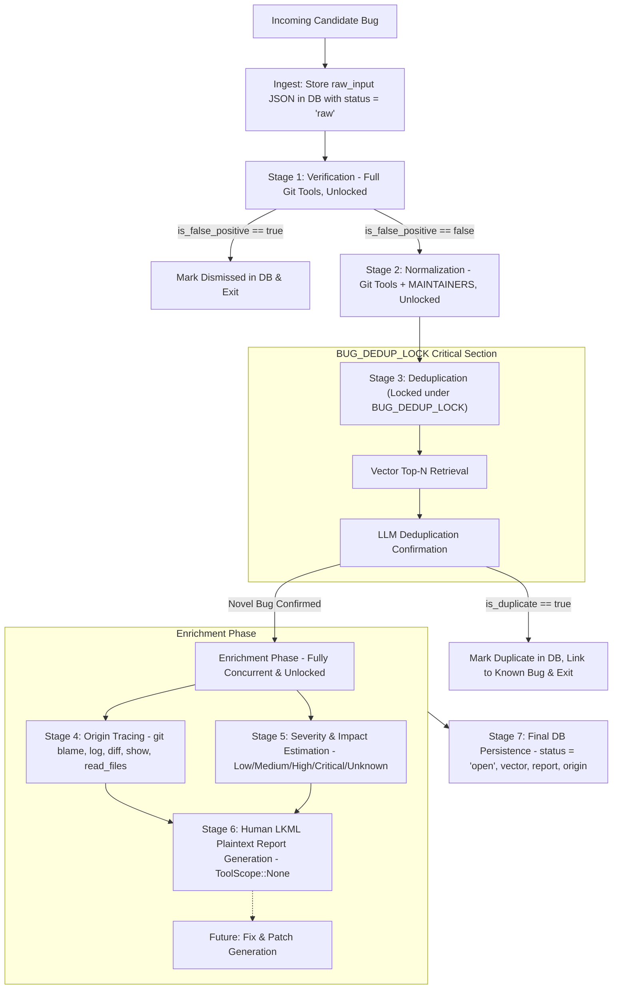

# Design: Standalone Linux Bug Pipeline V2

## 1. Overview & Objectives

Sashiko analyzes Linux kernel patches and codebase contexts, occasionally unearthing candidate pre-existing bugs and latent vulnerabilities. This design document specifies the architecture for the standalone Linux bug pipeline (**Pipeline V2**), replacing the initial prototype with a robust, modular, multi-stage workflow.

### 1.1 Key Goals
1. **Immutable Ingestion & Full Traceability**: Store the unadulterated incoming request payload as a `raw_input` JSON blob in the database before any LLM processing.
2. **Binary Ground-Truth Verification**: Laser-focus the first stage strictly on verifying whether the candidate defect is genuine or a false positive / hallucination against Linus's mainline top-of-trunk.
3. **Canonical Normalization with Codebase Context**: Standardize diverse bug titles, descriptions, and subsystem identifiers into a single convention using repository tools (`git_log`, `git_read_files`) and the compiled `MaintainersIndex`.
4. **Fast, Thread-Safe Deduplication**: Perform sparse vector similarity search and LLM deduplication confirmation inside a scoped critical section (`BUG_DEDUP_LOCK`) to prevent race conditions while keeping all other stages fully concurrent.
5. **Two-Tier Early Exits**: Short-circuit immediately on false positives (after Verification) and duplicates (after Deduplication), completely avoiding wasted git tracing and report generation.
6. **Multi-Stage Concurrent Enrichment**: For confirmed novel bugs only, run specialized enrichment stages:
   - **Origin Tracing**: Pinpoint introducing commit SHA using full git inspection tools (`git_log`, `git_diff`, `git_show`, `git_blame`, `git_read_files`).
   - **Severity & Impact Estimation**: Calibrate severity (`Low`, `Medium`, `High`, `Critical`, `Unknown`) and analyze attack preconditions and blast radius.
   - **Human LKML Report Generation**: Draft an objective, plain-text standalone review comment block.
7. **Accurate Review Linking**: Defer or update `review_bugs` associations so only confirmed novel bugs are marked as newly discovered, and duplicates are linked to their canonical parents.

---

## 2. Pipeline Architecture & State Transitions



---

## 3. Detailed Stage Specifications

### 3.1 Stage 0: Ingestion & Raw Input Capture
* **Entrypoint**: `process_issue(provider, tools, db, input, context_tag)`
* **Action**:
  1. Generate unique UUID slug for the bug.
  2. Serialize `input: BugInput` into `raw_input` JSON string.
  3. Insert into `bugs` table with `status = "raw"`.
  4. Return `BugOutcome::NewlyDiscovered` handle with queued bug record.

### 3.2 Stage 1: Verification & Ground-Truth Confirmation
* **Responsibility**: Determine whether the described defect can genuinely trigger in the top-of-trunk codebase, or if it is impossible, hallucinated, or a false positive.
* **Concurrency**: Unlocked (runs concurrently across worker tasks).
* **Tools**: Full Git Toolbox (`git_read_files`, `git_grep`, `git_blame`, `git_log`, `git_show`, `git_diff`).
* **Input**: Raw problem, reasoning, locations from `BugInput`, evaluated against `master_sha`.
* **Output Schema** (`VerificationJson`):
  ```rust
  #[derive(Deserialize, Debug)]
  pub struct VerificationJson {
      pub verification_reasoning: String,
      pub is_false_positive: bool,
      pub refutation_evidence: Option<String>,
      pub impact_severity: Option<String>,
      pub relevant_code_locations: Option<Value>,
  }
  ```
* **Early Exit**: If `is_false_positive == true`, the bug is updated to `status = "dismissed"` with `refutation_evidence` stored in `severity_explanation`. The pipeline terminates immediately.

### 3.3 Stage 2: Normalization & Canonical Naming
* **Responsibility**: Standardize problem titles, descriptions, and subsystems across diverse ingestion sources into a single canonical format.
* **Concurrency**: Unlocked.
* **Tools**: Git Toolbox (`git_log`, `git_read_files`, `git_grep`) plus a deterministic `MAINTAINERS` hint injected from `MaintainersIndex::match_files()`.
* **Input**: Verified problem details, verification reasoning, verified locations, and `MaintainersIndex` subsystem hint.
* **Output Schema** (`NormalizationJson`):
  ```rust
  #[derive(Deserialize, Debug, Clone)]
  pub struct NormalizationJson {
      pub canonical_title: String,
      pub canonical_description: String,
      pub primary_subsystem: String,
      pub affected_source_files: Vec<String>,
  }
  ```
* **Canonical Conventions**:
  - `canonical_title`: `<subsystem>: <root cause in function_name()>` (e.g. `btrfs: use-after-free in btrfs_cleanup_ordered_extents()`). Strict limit of <80 characters, no backticks, no markdown.
  - `canonical_description`: Structured summary covering trigger conditions, execution path, and failure mechanism.
  - `primary_subsystem`: Canonical short subsystem identifier (e.g. `net`, `bpf`, `btrfs`, `sched`, `drm/amdgpu`).

### 3.4 Stage 3: Fast Vector Search & Deduplication Confirmation
* **Responsibility**: Determine whether the normalized bug is an identical duplicate of any known, registered bug in the database.
* **Concurrency**: **Locked under `BUG_DEDUP_LOCK`**.
* **Tools**: None (pure comparison).
* **Steps**:
  1. Extract sparse feature vector from `canonical_title`, `primary_subsystem`, `affected_source_files`, and `relevant_code_locations`.
  2. Query `preexisting_bugs` / `bugs` table for Top $N=20$ candidate matches above similarity threshold (`0.65`).
  3. If candidates exist, invoke `DedupSession` (1-turn LLM comparison).
  4. **Root Cause Deduplication Rule**: Bugs with the same root cause but different reported consequences (e.g., wrong synchronization leading to a data race that manifests as a memory leak vs a use-after-free crash) are considered duplicates and merged. Rule of thumb: if fixing one issue will resolve the other issue, it is the same bug.
  5. **Strict Semantic Validation**: If `is_duplicate == true`, validator requires that `duplicate_of_id` matches one of the candidate IDs.
* **Early Exit**: If `is_duplicate == true`, record duplicate metadata in DB, link review, release lock, and exit early.

### 3.5 Stage 4: Origin Tracing (Enrichment)
* **Responsibility**: Pinpoint the exact 40-character commit SHA that introduced the vulnerability into the codebase.
* **Concurrency**: Unlocked.
* **Tools**: Full Git Toolbox (`git_blame`, `git_log`, `git_diff`, `git_show`, `git_read_files`).
* **Input**: Normalized title, description, and verified code locations.
* **Output Schema** (`TracingJson`):
  ```rust
  #[derive(Deserialize, Debug)]
  pub struct TracingJson {
      pub introducing_commit_sha: Option<String>,
  }
  ```
* **Validation**: Validates that any non-null SHA provided exists in git via `git cat-file -e <sha>^{commit}` using `tokio::task::spawn_blocking`.

### 3.6 Stage 5: Severity & Impact Estimation (Enrichment)
* **Responsibility**: Rigorously calibrate defect severity and detail attack preconditions, blast radius, and failure impact.
* **Concurrency**: Unlocked.
* **Tools**: None / Read-only.
* **Input**: Normalized title, description, and verified code locations.
* **Output Schema** (`SeverityJson`):
  ```rust
  #[derive(Deserialize, Debug)]
  pub struct SeverityJson {
      pub severity: String, // "Low", "Medium", "High", "Critical", "Unknown"
      pub severity_explanation: String,
  }
  ```
* **Escape Hatch**: Allows `"Unknown"` if preconditions cannot be definitively determined.

### 3.7 Stage 6: Standalone Plaintext LKML Report Generation (Enrichment)
* **Responsibility**: Draft an objective, standalone LKML-style review comment block.
* **Concurrency**: Unlocked.
* **Tools**: None (`ToolScope::None`).
* **Prompt Consistency**:
  - Follow standard plain-text email style wrapped at 75 characters.
  - Highlight special circumstances (e.g., 32-bit architecture) first at the start.
  - Keep code snippets short, cutting unnecessary parts using `<...>`, and highlighting key lines with `^^^^^`.
  - Keep description as short as possible while explaining all details, avoiding redundancy between code snippets and multi-CPU/column diagrams.
  - Code snippets indented with 4 spaces (no contradictory `>` instructions).
  - No backticks or markdown fences.
* **Output**: Plain-text String.

### 3.8 Stage 7: Final Database Persistence
* **Action**:
  Update bug record in `bugs` table:
  - `status = "open"`
  - `problem = canonical_title`
  - `severity = severity`
  - `severity_explanation = severity_explanation`
  - `locations = relevant_code_locations`
  - `subsystems = [primary_subsystem]`
  - `source_files = affected_source_files`
  - `inline_review = generated_report`
  - `vector_json = query_vector.to_json()`
  - `introduced_in_commit = formatted_sha`
  - `logs = serialized_turn_history`

---

## 4. Database Schema & Migration

### 4.1 Schema Modification
Add `raw_input` column to `bugs` table:
```sql
ALTER TABLE bugs ADD COLUMN raw_input TEXT;
```

### 4.2 Migration Strategy
In `src/db.rs`:
```rust
self.try_add_column("bugs", "raw_input", "TEXT").await?;
```
In `src/schema.sql`:
Add `raw_input TEXT` to `CREATE TABLE IF NOT EXISTS bugs (...)`.

### 4.3 Struct Updates in `src/db.rs`
Update `Bug` and `NewBug` to include `pub raw_input: Option<String>`.

---

## 5. Review Linking Model

To fix premature linking in `src/reviewer.rs`:
- When candidate pre-existing bugs are queued during patch review, `process_issue` returns the queued bug ID.
- `review_bugs` links are deferred until `BugWorker` completes:
  - **Novel Bug**: `link_review_to_bug(review_id, bug_id, true)` (`is_newly_discovered = 1`).
  - **Duplicate Bug**: `link_review_to_bug(review_id, duplicate_of_id, false)` (`is_newly_discovered = 0`).
  - **Dismissed Bug**: No active link created, or recorded as dismissed.

---

## 6. Testing Strategy

1. **Unit Tests in `src/workflows/linux_bug.rs`**:
   - `test_verify_session_valid`: Validates `VerificationJson` matching schema and prompt.
   - `test_normalize_session`: Validates `NormalizationJson` output and title format.
   - `test_dedup_session_duplicate`: Validates duplicate matching and candidate ID validation.
   - `test_dedup_session_invalid_id_rejected`: Ensures hallucinated candidate ID triggers format violation retry.
   - `test_origin_tracing_session`: Validates commit SHA extraction and git commit check.
   - `test_process_issue_flow_complete`: End-to-end multi-stage pipeline flow with mock responses.
   - `test_process_issue_early_exit_on_false_positive`: Ensures stages 2-6 are never executed if Stage 1 refutes bug.
   - `test_process_issue_early_exit_on_duplicate`: Ensures enrichment stages 4-6 are never executed if Stage 3 finds duplicate.
2. **Database Invariants**:
   - Run `make check-db-invariants` to verify schema integrity with new `raw_input` column.
3. **CI / CD Quality Gates**:
   - Run `make check-pr` (`sob`, `lint`, `test`) to ensure 100% compliance with Rust 1.90 and clippy.
