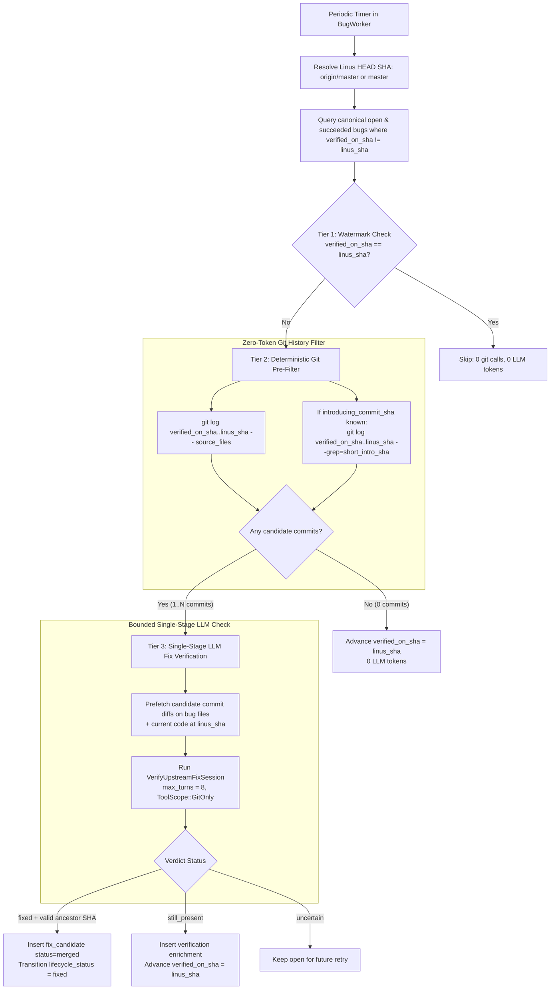

# Design: Optional Bug Database and Economical Upstream Fix Tracking

## 1. Context & Motivation

Sashiko discovers pre-existing bugs in surrounding code while reviewing patches and tracks them in a dedicated bugs database (`bugs`, `bug_occurrences`, `bug_enrichments`), processed asynchronously by `BugWorker` (`src/worker/bug_worker.rs`) and `workflows::linux_bug` (`src/workflows/linux_bug.rs`) across both supported projects (`ProjectId::Linux` and `ProjectId::Sashiko`).

Two operational requirements have emerged:
1. **Optional Bug Database (Disabled by Default):** Not all Sashiko deployments track pre-existing upstream bugs (for example, lightweight local or self-hosted instances). By default, pre-existing issues discovered during patch review should be ignored rather than reported as patch findings or queued for standalone bug analysis.
2. **Economical Periodic Upstream Fix Tracking:** For deployments that enable the bug database (`sashiko.dev` for the Linux kernel and `sashiko.sashiko.dev` for Sashiko itself), open bugs verified at an earlier mainline commit (`verified_on_sha`) may subsequently be fixed upstream (`master` in Linus Torvalds's tree or `main` in `sashiko-dev/sashiko`). Re-running the full multi-stage bug verification LLM pipeline across all open bugs after every mainline pull would consume prohibitive token budgets because the vast majority of open bugs reside in files that have not been modified since `verified_on_sha`.

This design specifies:
- Making the bug database opt-in (`[linux_bug] enabled = false` by default), ensuring pre-existing issues are excluded from patch review findings and ignored when the bug database is disabled, and enabling it in the production deployment manifests (`deployment/sashiko.dev` and `deployment/sashiko.sashiko.dev`).
- Supporting both `ProjectId::Linux` (C kernel code, `MAINTAINERS`, `prompts/severity.md`, `torvalds/linux` `master`) and `ProjectId::Sashiko` (Rust/SQL/HTML/YAML code, module-based subsystems, `prompts/sashiko/severity.md`, `sashiko-dev/sashiko` `main`) in the bug triage and upstream fix verification workflows.
- A three-tier periodic upstream fix checker in `BugWorker` that uses deterministic git history filtering to handle $>95\%$ of open bugs with **zero LLM tokens**, invoking a lightweight single-stage LLM fix verifier only when commits in `<verified_on_sha>..<linus_sha>` actually touch a bug's source files or reference its introducing commit.

---

## 2. Optional Bug Database & Pre-existing Issue Handling

### 2.1 Configuration (`[linux_bug]`)

Add `LinuxBugSettings` to `Settings` (`src/settings.rs`), deserialized from `[linux_bug]` (with `#[serde(alias = "bugs")]` for backwards compatibility):

```toml
[linux_bug]
# Enable tracking and background analysis of pre-existing bugs (default: false)
enabled = false
# Enable periodic verification of whether open bugs have been fixed upstream (default: false)
fix_check_enabled = false
# Lease TTL in seconds for in-progress bug claims
lease_ttl_seconds = 300
# Maximum pipeline attempts before marking a bug failed
max_attempts = 3
# Interval in seconds between periodic upstream fix checks against Linus's tree (0 = disabled)
fix_check_interval_seconds = 21600
# Maximum number of open bugs to evaluate per upstream fix check cycle
fix_check_batch_size = 50
```

### 2.2 Exclusion of Pre-existing Issues from Patch Findings

During `linux_patch_review` (`src/workflows/linux_patch_review.rs`), `conflict_resolution_stage` already routes `preexisting: true` items exclusively to `state.concerns` while excluding them from `state.findings` (matching `sashiko_patch_review.rs`). However, `verification_stage` in `linux_patch_review.rs` previously appended `preexisting: true` items to `state.concerns` *and* left them in `state.findings`, causing pre-existing bugs to appear in inline patch review emails.

`verification_stage` is updated to match `conflict_resolution_stage` and `sashiko_patch_review.rs`:
- Any finding marked `preexisting: true` is converted into a concern in `state.concerns` and excluded from `state.findings`.
- In `src/reviewer.rs`, when `!ctx.settings.linux_bug.enabled`, `concerns` extracted from reviews are ignored instead of creating `bugs` and `bug_occurrences` rows.

### 2.3 Worker, API, UI, and Deployment Gating

- **Background Worker (`src/main.rs`):** `BugWorker` is spawned only when `settings.linux_bug.enabled` is `true`, configured with `.with_project(settings.project.kind)` and `.with_settings(settings.linux_bug.clone())`. Periodic upstream fix verification runs only when `settings.linux_bug.fix_check_enabled` is `true`.
- **REST API (`src/api.rs`):**
  - `GET /api/config` includes `"bugs_enabled": state.settings.linux_bug.enabled` and `"bug_fix_check_enabled": state.settings.linux_bug.fix_check_enabled`.
  - `POST /api/bug/analyze` returns `404 Not Found` when `state.settings.linux_bug.enabled` is `false`.
- **Frontend (`static/index.html`):**
  - The `#btn-bugs` navigation button is hidden when `config.bugs_enabled === false`.
  - When a bug is fixed (`fixed_in_commit`), the UI displays `Fixed by: <12-char-sha> ("<subject>")` on the bug detail page (with Copy button), in the Fixes & Patches tab, in the Bugs table list view, and on patchset bug cards.
- **Deployment Manifests:**
  - `Settings.toml` leaves `linux_bug.enabled = false` and `linux_bug.fix_check_enabled = false` by default.
  - `deployment/sashiko.sashiko.dev/base/app/sashiko-self-k8s.yaml` sets `SASHIKO__LINUX_BUG__ENABLED: "true"` and `SASHIKO__LINUX_BUG__FIX_CHECK_ENABLED: "true"`.
  - `deployment/sashiko.dev/base/app/sashiko-k8s.yaml` sets `SASHIKO__LINUX_BUG__ENABLED: "true"` and `SASHIKO__LINUX_BUG__FIX_CHECK_ENABLED: "false"`.

---

## 3. Economical Upstream Fix Tracking in Linus's Tree

### 3.1 Architecture & Three-Tier Filtering Pipeline



### 3.2 Resolving Linus's Mainline Tree Reference

`BugWorker::resolve_master_sha` resolves `<mainline_remote>/master` (configured via `git.mainline_remote`, defaulting to `origin/master`, falling back to `master`, then `HEAD`). This guarantees that upstream fix checks exclusively inspect Linus's mainline branch rather than subsystem `-next` branches.

### 3.3 Tier 1 & Tier 2: Range-Indexed Zero-Token Git Pre-Filter ($\mathcal{O}(N_{\text{commits}})$ Scaling)

To scale to $\mathcal{O}(10\text{k})$ open bugs in the Linux kernel without spawning $\mathcal{O}(N_{\text{bugs}})$ separate `git` subprocesses or burning `fix_check_batch_size` slots on zero-token watermark advancements, `BugWorker::check_open_bugs_upstream` executes a two-phase sweep backed by an in-memory per-range index (`CommitRangeIndex`):

1. **Per-Range Git Index (`CommitRangeIndex`):**
   - In steady state, almost all open bugs share one (or a handful of) `verified_on_sha` values from the previous mainline sweep.
   - For each distinct `verified_on_sha` encountered (up to `MAX_CACHED_RANGES_PER_SWEEP = 64`), Sashiko verifies ancestry (`git merge-base --is-ancestor <verified_on_sha> <linus_sha>`) once and queries the commit range `<verified_on_sha>..<linus_sha>` once via `git log --no-merges -n 2001 -z --name-only --format=%x1e%H%x1f%B%x1d`.
   - If the range contains $\le 2{,}000$ non-merge commits (`MAX_INDEXED_RANGE_COMMITS`), `CommitRangeIndex` indexes:
     - `files_to_commits: HashMap<String, Vec<String>>` mapping each modified file path to the ordered commit SHAs touching it.
     - `commit_messages: Vec<(String, String)>` storing `(commit_sha, raw_body)` for fast in-memory `Fixes:` / `introducing_commit_sha` substring matching.
   - Candidate lookup for each bug at `verified_on_sha` is then an $\mathcal{O}(1)$ in-memory lookup requiring **zero per-bug `git` subprocesses**. If a historical range exceeds `MAX_INDEXED_RANGE_COMMITS`, lookup transparently falls back to per-bug `find_candidate_fix_commits`.
2. **Phase 1 — Keyset-Paginated Zero-Token Batch Advancement:**
   - Open canonical bugs (`lifecycle_status = 'open'`, `pipeline_state = 'succeeded'`, `duplicate_of_id IS NULL`, `verified_on_sha != linus_sha`) are scanned in chunks of `250` (`FIX_CHECK_SCAN_CHUNK_SIZE`, up to `MAX_FIX_CHECK_SCAN_CHUNKS = 80`, or `20,000` bugs per sweep) using keyset pagination on `(updated_at ASC, id ASC)` (`idx_bugs_fix_check`).
   - Bugs with **zero candidate commits** in `<verified_on_sha>..<linus_sha>` are batch-advanced to `linus_sha` in short SQLite transactions (`advance_open_bugs_without_llm_batch`, capped at 100 rows per transaction) without consuming `fix_check_batch_size`.
   - Bugs with $\ge 1$ candidate commits are queued for Phase 2 up to `fix_check_batch_size` (which exclusively bounds LLM verification sessions per sweep).
3. **Phase 2 — Bounded LLM Verification (`VerifyUpstreamFixSession`):**
   - For each queued bug (at most `fix_check_batch_size`), the worker atomically claims the specific bug lease (`claim_specific_open_bug_for_fix_check`) and runs `VerifyUpstreamFixSession` under `run_while_leased(..., maintain_lease(...))`.
4. **Non-Blocking Background Execution in `BugWorker::run`:**
   - Periodic upstream fix sweeps are spawned on a dedicated background task (guarded by an atomic/handle check so at most one sweep runs at a time) rather than blocking `claim_pending_bug` on the main worker loop.

### 3.4 Tier 3: Single-Stage LLM Fix Verification (`verify_upstream_fix`)

When one or more commits in `<verified_on_sha>..<linus_sha>` touch the bug's files or cite its introducing commit:

1. **Bounded Prefetching (Full Commit Diff with Per-File Fallback):**
   - For each candidate commit (up to `MAX_FIX_CANDIDATE_COMMITS = 10`), `prefetch_candidate_fix_commits` first fetches the full commit diff (`git show --stat --patch --unified=5 <sha>`). If the full commit diff fits within `MAX_FULL_COMMIT_PREFETCH_BYTES` (`12,000` bytes), it is included in full so cross-file fixes (such as adding a `Drop` guard in another module) are never stripped. Only when a candidate commit diff exceeds `MAX_FULL_COMMIT_PREFETCH_BYTES` does prefetching fall back to filtering by `-- <bug_files...>`, capped at `MAX_FIX_CHECK_PREFETCH_BYTES = 24,000` total bytes.
   - Prefetches the current code snippet around the bug's locations at `linus_sha`.
2. **Single-Stage Session (`VerifyUpstreamFixSession`):**
   - Equipped with `ToolScope::GitOnly` (`git_show`, `git_read_files`, `git_log`, `git_blame`, `git_grep`) and a tight turn budget (`max_turns = 8`).
   - Output schema (`UpstreamFixVerdict`):
     - `status`: `"fixed" | "still_present" | "uncertain"` (providing an explicit escape hatch per LLM Workflow Design guidelines).
     - `fixing_commit_sha`: `Option<String>` (required when `status == "fixed"`).
     - `explanation`: `String` citing concrete code changes in the fixing commit or explaining why the bug remains present at `linus_sha`.
3. **Deterministic Commit Validation:**
   - If the LLM reports `status == "fixed"`, validate `fixing_commit_sha` using `git rev-parse --verify <sha>^{commit}` and `git merge-base --is-ancestor <sha> <linus_sha>`.
   - If the SHA does not resolve to a valid ancestor of `linus_sha`, reject the `"fixed"` verdict and treat it as `"uncertain"` (preventing hallucinated commit SHAs from closing open bugs).
4. **Database State Transitions (`src/db.rs`):**
   - **Fixed:** `db.record_upstream_fix_check` atomically inserts a `fix_candidate` enrichment (`status: "merged"`, `commit_sha: full_fixing_sha`, `verified_on_sha: linus_sha`, `explanation`), advances `verified_on_sha`, and updates `lifecycle_status = 'fixed'` (`WHERE id = ? AND lifecycle_status = 'open'`).
   - **Still Present:** `db.record_upstream_fix_check` inserts a `verification` enrichment advancing `verified_on_sha` to `linus_sha` (preserving existing `locations` and `source_files`) so the same commits are not re-evaluated on the next cycle.

---

## 4. Verification & Testing Plan

1. **Patch Review Pre-existing Exclusion:**
   - Verify `verification_stage` unit tests confirm `preexisting: true` findings are placed only in `state.concerns` and excluded from `state.findings`.
2. **Optional Bug Database Config & Gating:**
   - Verify `Settings::new()` defaults `linux_bug.enabled` to `false`.
   - Verify `Reviewer::process_issue` skips creating bugs when `linux_bug.enabled == false`.
   - Verify `/api/config` exposes `bugs_enabled` and `/api/bug/analyze` rejects requests when disabled.
3. **Upstream Fix Tracking & Scalability Tests:**
   - **Zero-token path & `CommitRangeIndex`:** Create a temporary git repository with open bugs verified at commit A, add commits touching specific files and citing `Fixes:` tags, and verify `CommitRangeIndex` matches both file-touching and `Fixes:`-citing commits while advancing untouched bugs with 0 AI calls.
   - **Batch scalability beyond `fix_check_batch_size`:** Verify that when `fix_check_batch_size` is small (e.g. `2`), `BugWorker::check_open_bugs_upstream` still advances all untouched open bugs in a single sweep while limiting LLM evaluations to `fix_check_batch_size`.
   - **Cross-file fix prefetching:** Verify `prefetch_candidate_fix_commits` includes cross-file hunks when a candidate commit fits within `MAX_FULL_COMMIT_PREFETCH_BYTES`.
   - **Fixed / Hallucinated / Still-present paths:** Verify `Fixed`, `Uncertain`, and `StillPresentAfterLlm` state transitions.
4. **CI & Self-Review:**
   - Run `make check-pr` and `sashiko review --project sashiko --agent` across all commits.
