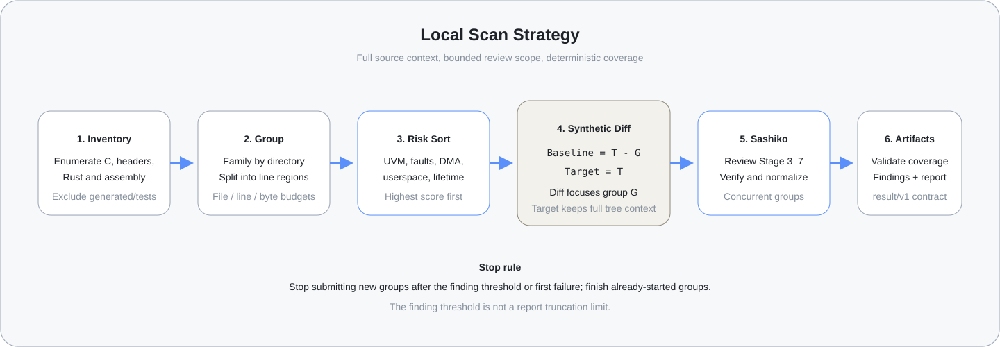

# GPU Driver Code Scan

[简体中文](README.zh-CN.md) | English

## What It Does

`gpu-driver-code-scan` is a local command-line scanner for Linux GPU driver
source trees. It inventories an existing directory, reviews risk-ordered groups
with [Sashiko](https://github.com/FFizzZZ/sashiko), and writes versioned JSON
artifacts plus a Markdown report.

It can be installed either as a standard Python CLI or as a thin Agent Skill.
Both interfaces run the same scanner implementation and produce the same
versioned artifact contract.

## Scan Strategy



1. **Inventory** reviewable source files and exclude generated or test output.
2. **Group** files by directory; split large files into contiguous line regions
   within file, line, and byte budgets.
3. **Sort** groups by GPU-driver risk signals such as UVM/HMM, page faults,
   DMA/IOMMU, userspace APIs, compute queues, locking, and lifetime management.
4. For each group `G` in the complete tree `T`, construct a synthetic pair:

   ```text
   Baseline = T - G
   Target   = T
   ```

   The diff contains only `G`, while the target commit still gives Sashiko the
   full source tree and original line numbers for context.
5. Review groups concurrently, normalize findings, verify complete region
   assignment, and write `scan-result.json`, `findings.json`, and `report.md`.

`--max-findings` stops submission of new groups; it does not truncate results.
Already-started groups finish and all of their findings remain in the report.

## Command Line

Initialize and install once:

```bash
git clone https://github.com/FFizzZZ/sashiko.git
cd sashiko
cargo build --release --bin review --manifest-path Cargo.toml
cd python
python3 -m pip install -e .
```

To install the same program as an Agent Skill instead:

```bash
scripts/install-skill --target ~/.codex
```

The installed `$gpu-driver-code-scan` Skill collects the local source and
output paths, then invokes the same scanner implementation through this CLI.

Run with the public defaults:

```bash
gpu-driver-code-scan scan /path/to/driver \
  --output-dir ./artifacts/run-001
```

| Argument | Description | Default |
|---|---|---|
| `source_dir` | Existing local driver source directory | required |
| `--output-dir` | Empty directory for generated artifacts | required |
| `--project` | Project name in artifacts and report | source directory name |
| `--driver-url` | Optional driver locator shown in the report | empty |
| `--kernel-url` | Optional kernel-context locator shown in the report | empty |
| `--provider` | Sashiko AI provider | `codex-cli` |
| `--model` | Provider model | `gpt-5.5-2026-04-24` |
| `--concurrency` | Concurrent scan groups | `3` |
| `--max-findings` | Threshold for stopping new group submission | `10` |
| `--max-files-per-group` | Maximum distinct files in one group | `30` |
| `--max-lines-per-group` | Maximum target lines in one group | `1000` |
| `--max-bytes-per-group` | Maximum target bytes in one group | `100000` |
| `--max-review-seconds` | Whole-scan review budget; `0` disables | `7200` |
| `--review-timeout-seconds` | Timeout for one Sashiko group | `3600` |
| `--stages` | Sashiko review stages | `3,4,5,6,7` |
| `--include` | Additional inventory glob; repeatable | none |
| `--plan-only` | Build inventory, groups, and patch map without AI | `false` |
| `--no-ai` | Exercise Sashiko patch handling without model calls | `false` |

Validate a completed output directory with:

```bash
gpu-driver-code-scan validate ./artifacts/run-001
```
